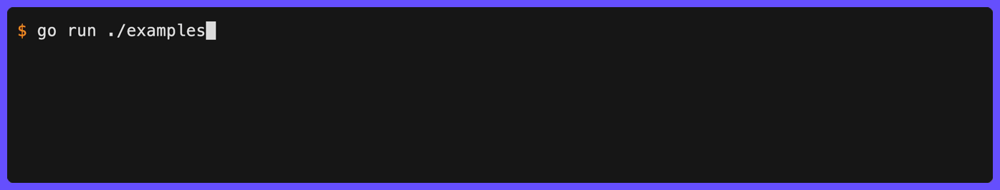

<h1 align="center"><code>clog</code></h1>

Structured CLI logging for Go with terminal-aware colours, hyperlinks, and animations. A [zerolog](https://github.com/rs/zerolog)-style fluent API designed for command-line tools.

## Demo

<p align="center">
  
</p>

## Installation

```sh
go get github.com/gechr/clog
```

## Quick Start

```go
package main

import (
  "fmt"

  "github.com/gechr/clog"
)

func main() {
  clog.Info().Str("port", "8080").Msg("Server started")
  clog.Warn().Str("path", "/old").Msg("Deprecated endpoint")
  err := fmt.Errorf("connection refused")
  clog.Error().Err(err).Msg("Connection failed")
}
```

Output:

```text
INF ℹ️ Server started port=8080
WRN ⚠️ Deprecated endpoint path=/old
ERR ❌ Connection failed error=connection refused
```

## Levels

| Level   | Label | Prefix | Description                                          |
| ------- | ----- | ------ | ---------------------------------------------------- |
| `Trace` | `TRC` | 🔍     | Finest-grained output, hidden by default             |
| `Debug` | `DBG` | 🐞     | Verbose output, hidden by default                    |
| `Info`  | `INF` | ℹ️     | General operational messages (default minimum level) |
| `Dry`   | `DRY` | 🚧     | Dry-run indicators                                   |
| `Warn`  | `WRN` | ⚠️     | Warnings that don't prevent operation                |
| `Error` | `ERR` | ❌     | Errors that need attention                           |
| `Fatal` | `FTL` | 💥     | Fatal errors - calls `os.Exit(1)` after logging      |

### Setting the Level

```go
// Programmatically
clog.SetLevel(clog.DebugLevel)

// From environment variable (CLOG_LOG_LEVEL is checked automatically on init)
// export CLOG_LOG_LEVEL=debug
```

Recognised `CLOG_LOG_LEVEL` values: `trace`, `debug`, `info`, `dry`, `warn`, `warning`, `error`, `fatal`, `critical`.

Setting `trace` or `debug` also enables timestamps.

### Parsing Levels

`ParseLevel` converts a string to a `Level` value (case-insensitive):

```go
level, err := clog.ParseLevel("debug")
```

`Level` implements `encoding.TextMarshaler` and `encoding.TextUnmarshaler`, so it works directly with `flag.TextVar` and most flag libraries.

## Structured Fields

Events and contexts support typed field methods. All methods are safe to call on a nil receiver (disabled events are no-ops).

### Event Fields

| Method       | Signature                                     | Description                                                               |
| ------------ | --------------------------------------------- | ------------------------------------------------------------------------- |
| `Any`        | `Any(key string, val any)`                    | Arbitrary value                                                           |
| `Anys`       | `Anys(key string, vals []any)`                | Arbitrary value slice                                                     |
| `Base64`     | `Base64(key string, val []byte)`              | Byte slice as base64 string                                               |
| `Bool`       | `Bool(key string, val bool)`                  | Boolean field                                                             |
| `Bools`      | `Bools(key string, vals []bool)`              | Boolean slice field                                                       |
| `Bytes`      | `Bytes(key string, val []byte)`               | Byte slice — auto-detected as JSON with highlighting, otherwise string    |
| `Column`     | `Column(key, path string, line, column int)`  | Clickable file:line:column hyperlink                                      |
| `Dict`       | `Dict(key string, dict *Event)`               | Nested fields with dot-notation keys                                      |
| `Duration`   | `Duration(key string, val time.Duration)`     | Duration field                                                            |
| `Durations`  | `Durations(key string, vals []time.Duration)` | Duration slice field                                                      |
| `Err`        | `Err(err error)`                              | Attach error; `Send` uses it as message, `Msg`/`Msgf` add `"error"` field |
| `Errs`       | `Errs(key string, vals []error)`              | Error slice as string slice (nil errors render as `<nil>`)                |
| `Float64`    | `Float64(key string, val float64)`            | Float field                                                               |
| `Floats64`   | `Floats64(key string, vals []float64)`        | Float slice field                                                         |
| `Func`       | `Func(fn func(*Event))`                       | Lazy field builder; callback skipped on nil (disabled) events             |
| `Hex`        | `Hex(key string, val []byte)`                 | Byte slice as hex string                                                  |
| `Int`        | `Int(key string, val int)`                    | Integer field                                                             |
| `Int64`      | `Int64(key string, val int64)`                | 64-bit integer field                                                      |
| `Ints`       | `Ints(key string, vals []int)`                | Integer slice field                                                       |
| `Ints64`     | `Ints64(key string, vals []int64)`            | 64-bit integer slice field                                                |
| `JSON`       | `JSON(key string, val any)`                   | Marshals val to JSON with syntax highlighting                             |
| `Line`       | `Line(key, path string, line int)`            | Clickable file:line hyperlink                                             |
| `Link`       | `Link(key, url, text string)`                 | Clickable URL hyperlink                                                   |
| `Path`       | `Path(key, path string)`                      | Clickable file/directory hyperlink                                        |
| `Percent`    | `Percent(key string, val float64)`            | Percentage with gradient colour                                           |
| `Quantities` | `Quantities(key string, vals []string)`       | Quantity slice field                                                      |
| `Quantity`   | `Quantity(key, val string)`                   | Quantity field (e.g. `"10GB"`)                                            |
| `RawJSON`    | `RawJSON(key string, val []byte)`             | Pre-serialized JSON bytes, emitted verbatim with syntax highlighting      |
| `Str`        | `Str(key, val string)`                        | String field                                                              |
| `Stringer`   | `Stringer(key string, val fmt.Stringer)`      | Calls `String()` (nil-safe)                                               |
| `Stringers`  | `Stringers(key string, vals []fmt.Stringer)`  | Slice of `fmt.Stringer` values                                            |
| `Strs`       | `Strs(key string, vals []string)`             | String slice field                                                        |
| `Time`       | `Time(key string, val time.Time)`             | Time field                                                                |
| `Times`      | `Times(key string, vals []time.Time)`         | Time slice field                                                          |
| `Uint`       | `Uint(key string, val uint)`                  | Unsigned integer field                                                    |
| `Uint64`     | `Uint64(key string, val uint64)`              | 64-bit unsigned integer field                                             |
| `Uints`      | `Uints(key string, vals []uint)`              | Unsigned integer slice field                                              |
| `Uints64`    | `Uints64(key string, vals []uint64)`          | 64-bit unsigned integer slice field                                       |
| `URL`        | `URL(key, url string)`                        | Clickable URL hyperlink (URL as text)                                     |

### Finalising Events

```go
clog.Info().Str("k", "v").Msg("message")  // Log with message
clog.Info().Str("k", "v").Msgf("n=%d", 5) // Log with formatted message
clog.Info().Str("k", "v").Send()          // Log with empty message
clog.Error().Err(err).Send()              // Log with error as message (no error= field)
clog.Error().Err(err).Msg("failed")       // Log with message + error= field
```

## Sub-loggers

Create sub-loggers with preset fields using the `With()` context builder:

```go
logger := clog.With().Str("component", "auth").Logger()
logger.Info().Str("user", "john").Msg("Authenticated")
// INF ℹ️ Authenticated component=auth user=john
```

Context fields support the same typed methods as events.

## Context Propagation

Store a logger in a `context.Context` and retrieve it deeper in the call stack:

```go
logger := clog.With().Str("request_id", "abc-123").Logger()
ctx := logger.WithContext(ctx)

// later, in any function that receives ctx:
clog.Ctx(ctx).Info().Msg("Handling request")
// INF ℹ️ Handling request request_id=abc-123
```

`Ctx` returns `clog.Default` when the context is `nil` or contains no logger, so it is always safe to call.

A package-level `WithContext` convenience stores `clog.Default`:

```go
ctx := clog.WithContext(ctx) // stores clog.Default
```

## Omitting Empty / Zero Fields

**OmitEmpty** omits fields that are semantically "nothing": `nil`, empty strings `""`, and nil or empty slices and maps.

```go
clog.SetOmitEmpty(true)
clog.Info().
  Str("name", "alice").
  Str("nickname", "").   // omitted
  Any("role", nil).      // omitted
  Int("age", 0).         // kept (zero but not empty)
  Bool("admin", false).  // kept (zero but not empty)
  Msg("User")
// INF ℹ️ User name=alice age=0 admin=false
```

**OmitZero** is a superset of `OmitEmpty` - it additionally omits `0`, `false`, `0.0`, zero durations, and any other typed zero value.

```go
clog.SetOmitZero(true)
clog.Info().
  Str("name", "alice").
  Str("nickname", "").   // omitted
  Any("role", nil).      // omitted
  Int("age", 0).         // omitted
  Bool("admin", false).  // omitted
  Msg("User")
// INF ℹ️ User name=alice
```

Both settings are inherited by sub-loggers created with `With()`. When both are enabled, `OmitZero` takes precedence.

## Quoting

By default, field values containing spaces or special characters are wrapped in Go-style double quotes (`"hello world"`). This behaviour can be customised with `SetQuoteMode`.

### Quote Modes

| Mode          | Description                                                                   |
| ------------- | ----------------------------------------------------------------------------- |
| `QuoteAuto`   | Quote only when needed - spaces, unprintable chars, embedded quotes (default) |
| `QuoteAlways` | Always quote string, error, and default-kind values                           |
| `QuoteNever`  | Never quote                                                                   |

```go
// Default: only quote when needed
clog.Info().Str("reason", "timeout").Str("msg", "hello world").Msg("test")
// INF ℹ️ test reason=timeout msg="hello world"

// Always quote string values
clog.SetQuoteMode(clog.QuoteAlways)
clog.Info().Str("reason", "timeout").Msg("test")
// INF ℹ️ test reason="timeout"

// Never quote
clog.SetQuoteMode(clog.QuoteNever)
clog.Info().Str("msg", "hello world").Msg("test")
// INF ℹ️ test msg=hello world
```

### Custom Quote Character

Use a different character for both sides:

```go
clog.SetQuoteChar('\'')
clog.Info().Str("msg", "hello world").Msg("test")
// INF ℹ️ test msg='hello world'
```

### Asymmetric Quote Characters

Use different opening and closing characters:

```go
clog.SetQuoteChars('«', '»')
clog.Info().Str("msg", "hello world").Msg("test")
// INF ℹ️ test msg=«hello world»

clog.SetQuoteChars('[', ']')
clog.Info().Str("msg", "hello world").Msg("test")
// INF ℹ️ test msg=[hello world]
```

Quoting applies to individual field values and to elements within string and `[]any` slices. All quoting settings are inherited by sub-loggers. Pass `0` to reset to the default (`strconv.Quote`).

## Dict (Nested Fields)

Group related fields under a common key prefix using dot notation:

```go
clog.Info().Dict("request", clog.Dict().
  Str("method", "GET").
  Int("status", 200),
).Msg("Handled")
// INF ℹ️ Handled request.method=GET request.status=200
```

Works with sub-loggers too:

```go
logger := clog.With().Dict("db", clog.Dict().
  Str("host", "localhost").
  Int("port", 5432),
).Logger()
```

## Custom Prefix

Override the default emoji prefix per-event, per-logger, or globally:

```go
// Per-event
clog.Info().Prefix("📦").Str("pkg", "clog").Msg("Installed")

// Per-logger (via sub-logger)
logger := clog.With().Prefix("🔒").Str("component", "auth").Logger()
logger.Info().Msg("Ready")

// Global (changes defaults for all levels)
clog.SetPrefixes(clog.LevelMap{
  clog.InfoLevel:  ">>",
  clog.WarnLevel:  "!!",
  clog.ErrorLevel: "XX",
})
```

Prefix resolution order: event override > logger preset > default emoji for level.

Missing levels in `SetPrefixes` fall back to the defaults. Use `DefaultPrefixes()` to get a copy of the default prefix map.

## Custom Labels

Override the default level labels with `SetLevelLabels`:

```go
clog.SetLevelLabels(clog.LevelMap{
  clog.InfoLevel:  "INFO",
  clog.WarnLevel:  "WARNING",
  clog.ErrorLevel: "ERROR",
})
```

Missing levels fall back to the defaults. Use `DefaultLabels()` to get a copy of the default label map.

When custom labels have different widths, control alignment with `SetLevelAlign`:

```go
clog.SetLevelAlign(clog.AlignRight)   // default: "   INFO", "WARNING", "  ERROR"
clog.SetLevelAlign(clog.AlignLeft)    //          "INFO   ", "WARNING", "ERROR  "
clog.SetLevelAlign(clog.AlignCenter)  //          " INFO  ", "WARNING", " ERROR "
clog.SetLevelAlign(clog.AlignNone)    //          "INFO",    "WARNING", "ERROR"
```

## Part Order

Control which parts appear in log output and in what order. The default order is: timestamp, level, prefix, message, fields.

```go
// Reorder: show message before level
clog.SetParts(clog.PartMessage, clog.PartLevel, clog.PartPrefix, clog.PartFields)

// Hide parts by omitting them
clog.SetParts(clog.PartLevel, clog.PartMessage, clog.PartFields) // no prefix or timestamp

// Fields before message
clog.SetParts(clog.PartLevel, clog.PartFields, clog.PartMessage)
```

Available parts: `PartTimestamp`, `PartLevel`, `PartPrefix`, `PartMessage`, `PartFields`.

Use `DefaultParts()` to get the default ordering. Parts omitted from the list are hidden.

## Spinners

Display animated spinners during long-running operations:

```go
err := clog.Spinner("Downloading").
  Str("url", fileURL).
  Wait(ctx, func(ctx context.Context) error {
    return download(ctx, fileURL)
  }).
  Msg("Downloaded")
```

The spinner animates with moon phase emojis (🌔🌓🌒🌑🌘🌗🌖🌕) while the action runs, then logs the result. This is the `DefaultSpinnerStyle`, which is used when no custom `Style` is set.

### Dynamic Status Updates

Use `Progress` to update the spinner message and fields during execution:

```go
err := clog.Spinner("Processing").
  Progress(ctx, func(ctx context.Context, update *clog.ProgressUpdate) error {
    for i, item := range items {
      update.Msg("Processing").Str("progress", fmt.Sprintf("%d/%d", i+1, len(items))).Send()
      if err := process(ctx, item); err != nil {
        return err
      }
    }
    return nil
  }).
  Msg("Processed all items")
```

### WaitResult Finalisers

| Method      | Success behaviour                  | Failure behaviour                      |
| ----------- | ---------------------------------- | -------------------------------------- |
| `.Msg(s)`   | Logs at `INF` with message         | Logs at `ERR` with error string        |
| `.Err()`    | Logs at `INF` with spinner message | Logs at `ERR` with error string as msg |
| `.Send()`   | Logs at configured level           | Logs at configured level               |
| `.Silent()` | Returns error, no logging          | Returns error, no logging              |

`.Err()` is equivalent to calling `.Send()` with default settings (no `OnSuccess`/`OnError` overrides).

All finalisers return the `error` from the action. You can chain any field method (`.Str()`, `.Int()`, `.Bool()`, `.Duration()`, etc.) and `.Prefix()` on a `WaitResult` before finalising.

### Custom Success/Error Behaviour

Use `OnSuccessLevel`, `OnSuccessMessage`, `OnErrorLevel`, and `OnErrorMessage` to customise how the result is logged, then call `.Send()`:

```go
// Fatal on error instead of the default error level
err := clog.Spinner("Connecting to database").
  Str("host", "db.internal").
  Wait(ctx, connectToDB).
  OnErrorLevel(clog.FatalLevel).
  Send()
```

When `OnErrorMessage` is set, the custom message becomes the log message and the original error is included as an `error=` field. Without it, the error string is used directly as the message with no extra field.

### Custom Spinner Style

```go
clog.Spinner("Loading").
  Style(clog.SpinnerDot).
  Wait(ctx, action).
  Msg("Done")
```

See [`progress_spinner_presets.go`](progress_spinner_presets.go) for the full list of available spinner types.

### Hyperlink Fields on Animations

The `AnimationBuilder` supports the same clickable hyperlink field methods as events:

```go
clog.Spinner("Building").
  Path("dir", "src/").
  Line("config", "config.yaml", 42).
  Column("loc", "main.go", 10, 5).
  URL("docs", "https://example.com").
  Link("help", "https://example.com", "docs").
  Wait(ctx, action).
  Msg("Built")
```

### Elapsed Timer

Add a live elapsed-time field to any animation with `.Elapsed(key)`:

```go
err := clog.Spinner("Processing batch").
  Str("batch", "1/3").
  Elapsed("elapsed").
  Int("workers", 4).
  Wait(ctx, processBatch).
  Msg("Batch processed")
// INF ✅ Batch processed batch=1/3 elapsed=2s workers=4
```

The elapsed field respects its position relative to other field methods — it appears between `batch` and `workers` in the output above because `.Elapsed("elapsed")` was called between `.Str()` and `.Int()`.

The display format uses `SetElapsedPrecision` (default 0 decimal places), rounds to `SetElapsedRound` (default 1s), hides values below `SetElapsedMinimum` (default 1s), and can be fully overridden with `SetElapsedFormatFunc`. Durations >= 1m use composite format (e.g. "1m30s", "2h15m").

### Delayed Animation

Use `.After(d)` to suppress the animation for an initial duration. If the task finishes before the delay, no animation is shown at all — useful for operations that are usually fast but occasionally slow:

```go
err := clog.Spinner("Fetching config").
  After(time.Second).
  Wait(ctx, fetchConfig).
  Msg("Config loaded")
```

If `fetchConfig` completes in under 1 second, the user sees nothing until the final "Config loaded" message. If it takes longer, the spinner appears after 1 second.

### Pulse Animation

`Pulse` creates an independent animation where all characters in the message fade uniformly between gradient colours.

```go
// Default gradient (blue-gray to cyan)
clog.Pulse("Warming up").
  Wait(ctx, action).
  Msg("Ready")

// Custom gradient
clog.Pulse("Replicating",
  clog.ColorStop{Position: 0, Color: colorful.Color{R: 1, G: 0.2, B: 0.2}},
  clog.ColorStop{Position: 0.5, Color: colorful.Color{R: 1, G: 1, B: 0.3}},
  clog.ColorStop{Position: 1, Color: colorful.Color{R: 1, G: 0.2, B: 0.2}},
).
  Wait(ctx, action).
  Msg("Replicated")
```

Use `DefaultPulseGradient()` to get the default gradient stops.

### Shimmer Animation

`Shimmer` creates an independent animation where each character is coloured based on its position in a sweeping gradient wave.

```go
// Default gradient
clog.Shimmer("Indexing documents").
  Wait(ctx, action).
  Msg("Indexed")

// Custom gradient with direction
clog.Shimmer("Synchronizing",
  clog.ColorStop{Position: 0, Color: colorful.Color{R: 0.3, G: 0.3, B: 0.8}},
  clog.ColorStop{Position: 0.5, Color: colorful.Color{R: 1, G: 1, B: 1}},
  clog.ColorStop{Position: 1, Color: colorful.Color{R: 0.3, G: 0.3, B: 0.8}},
).
  ShimmerDirection(clog.DirectionMiddleIn).
  Wait(ctx, action).
  Msg("Synchronized")
```

Use `DefaultShimmerGradient()` to get the default gradient stops.

#### Shimmer Directions

| Constant              | Description                              |
| --------------------- | ---------------------------------------- |
| `DirectionRight`      | Left to right (default)                  |
| `DirectionLeft`       | Right to left                            |
| `DirectionMiddleIn`   | Inward from both edges                   |
| `DirectionMiddleOut`  | Outward from the center                  |
| `DirectionBounceIn`   | Inward from both edges, then bounces out |
| `DirectionBounceOut`  | Outward from center, then bounces in     |

#### Animation Speed

Control how fast the animation cycles with `Speed(cyclesPerSecond)`. The default is `0.5` (one full cycle every two seconds) for both Shimmer and Pulse. Values ≤ 0 are treated as the default.

```go
clog.Shimmer("Fast shimmer").
  Speed(2.0).  // 2 gradient cycles per second
  Wait(ctx, action).
  Msg("Done")

clog.Pulse("Quick pulse").
  Speed(1.5).  // 1.5 oscillations per second
  Wait(ctx, action).
  Msg("Done")
```

Both pulse and shimmer use `ColorStop` for gradient definitions:

```go
type ColorStop struct {
  Position float64        // 0.0-1.0
  Color    colorful.Color // from github.com/lucasb-eyer/go-colorful
}
```

### Bar Animation

`Bar` creates a determinate progress bar that shows filled/empty cells and a live percentage. Use `SetProgress` on the `ProgressUpdate` to advance the bar.

```go
err := clog.Bar("Downloading", 100).
  Str("file", "release.tar.gz").
  Elapsed("elapsed").
  Progress(ctx, func(ctx context.Context, p *clog.ProgressUpdate) error {
    for i := range 101 {
      p.SetProgress(i).Msg("Downloading").Send()
      time.Sleep(20 * time.Millisecond)
    }
    return nil
  }).
  Prefix("✅").
  Msg("Download complete")
// INF ⏳ Downloading [━━━━━━━━╸───────────] 42% elapsed=1.2s
// INF ✅ Download complete file=release.tar.gz elapsed=3.4s
```

`SetTotal` can be called mid-task to update the denominator if the total becomes known after the task starts:

```go
p.SetProgress(50).SetTotal(200).Msg("Processing").Send()
```

#### Bar Styles

Six pre-built styles are available in [`progress_bar_presets.go`](progress_bar_presets.go). Pass any of them to `.Style()`:

| Preset        | Characters     | Description                                     |
| ------------- | -------------- | ----------------------------------------------- |
| `BarBasic`    | `[=====>    ]` | ASCII-only for maximum compatibility            |
| `BarDash`     | `[-----     ]` | Simple dash fill                                |
| `BarThin`     | `[━━━╺──────]` | Box-drawing with half-cell resolution (default) |
| `BarBlock`    | `│█████░░░░░│` | Solid block characters                          |
| `BarGradient` | `│██████▍   │` | Block elements with 8x sub-cell resolution      |
| `BarSmooth`   | `│████▌     │` | Block characters with half-block leading edge   |

```go
clog.Bar("Uploading", total).
  Style(clog.BarSmooth).
  Progress(ctx, task).
  Msg("Done")
```

`BarThin` and `BarSmooth` use half-cell resolution via `HalfFilled` (and `HalfEmpty` for `BarThin`), giving twice the visual granularity of full-cell styles. `BarGradient` uses `FillGradient` for 8x sub-cell resolution — the smoothest built-in option.

#### Custom BarStyle

Build a fully custom style by passing a `BarStyle` struct:

```go
clog.Bar("Uploading", total).
  Style(clog.BarStyle{
    Align:           clog.BarAlignInline, // inline with message (default: BarAlignRightPad)
    CapStyle:        new(lipgloss.NewStyle().Bold(true)),  // style for [ ] caps (default: bold white)
    EmptyChar:       '-',
    EmptyStyle:      new(lipgloss.NewStyle().Foreground(lipgloss.Color("8"))),  // grey
    FilledChar:      '=',
    FilledStyle:     new(lipgloss.NewStyle().Foreground(lipgloss.Color("2"))),  // green
    HalfEmpty:       0,      // half-cell trailing edge for 2x resolution (0 = disabled)
    HalfFilled:      0,      // half-cell leading edge for 2x resolution (0 = disabled)
    HeadChar:        '>',    // decorative head at leading edge (0 = disabled)
    HidePercent:     true,   // hide the inline percentage label (default: false)
    LeftCap:         "|",
    MaxWidth:        40,     // auto-size maximum (default 40)
    MinWidth:        10,     // auto-size minimum (default 10)
    PercentPosition:  clog.PercentLeft, // percentage before bar (default: PercentRight)
    PercentPrecision: 1,               // decimal places for percentage (default: 0 → "50%", 1 → "50.0%")
    RightCap:         "|",
    Separator:        " ",    // separator between message, bar, and percentage
    Width:            30,     // fixed inner width (0 = auto-size from terminal)
  }).
  Progress(ctx, task).
  Msg("Done")
```

When `Width` is 0, the bar auto-sizes to one quarter of the terminal width, clamped to `[MinWidth, MaxWidth]`.

`NoPadPercent` disables fixed-width padding on the percentage label (e.g. `" 0%"`, `" 50%"`, `"100%"`). By default padding is enabled to prevent the bar from jumping as digits change. Set `NoPadPercent: true` to disable.

All presets include bold white `CapStyle` for the bar caps. Set `CapStyle` to `nil` for unstyled caps.

#### Progress Gradient

Color the bar fill based on progress using `ProgressGradient`. The filled portion shifts through the gradient as progress advances (e.g. red at 0%, yellow at 50%, green at 100%):

```go
style := clog.BarBlock
style.ProgressGradient = clog.DefaultBarGradient() // red → yellow → green

clog.Bar("Building", 100).
  Style(style).
  Progress(ctx, task).
  Msg("Built")
```

Custom gradients work the same as other gradient fields:

```go
style.ProgressGradient = []clog.ColorStop{
  {Position: 0, Color: colorful.Color{R: 0.3, G: 0.3, B: 1}},   // blue
  {Position: 0.5, Color: colorful.Color{R: 1, G: 1, B: 1}},     // white
  {Position: 1, Color: colorful.Color{R: 0.3, G: 1, B: 0.3}},   // green
}
```

When set, `ProgressGradient` overrides the `FilledStyle` foreground color. Use `DefaultBarGradient()` to get the default red → yellow → green stops.

#### Bar Alignment

The `Align` field on `BarStyle` controls where the bar appears on the line:

| Constant           | Layout                                                                  |
| ------------------ | ----------------------------------------------------------------------- |
| `BarAlignRightPad` | `INF ⏳ Downloading                     [━━━━━╸╺──────] 45%` (default)  |
| `BarAlignLeftPad`  | `INF ⏳ [━━━━━╸╺──────] 45%                     Downloading`            |
| `BarAlignInline`   | `INF ⏳ Downloading [━━━━━╸╺──────] progress=45%` (with `PercentField`) |
| `BarAlignRight`    | `INF ⏳ Downloading [━━━━━╸╺──────] 45%`                                |
| `BarAlignLeft`     | `INF ⏳ [━━━━━╸╺──────] 45% Downloading`                                |

The padded variants (`BarAlignRightPad`, `BarAlignLeftPad`) fill the gap between message and bar with spaces to span the terminal width. When the terminal is too narrow, they fall back to the `Separator` between parts.

#### Bar Percentage as a Field

By default the percentage is displayed beside the bar. `BarAlignInline` automatically shows it as a structured field instead (key defaults to `"progress"`):

```go
clog.Bar("Syncing", 100).
  Style(clog.BarStyle{Align: clog.BarAlignInline}).
  Elapsed("elapsed").
  Progress(ctx, task).
  Msg("Synced")
// INF ⏳ Syncing [━━━━━╸╺──────] elapsed=1.2s progress=45%
```

Override the key with `PercentField` on the style, or use `.BarPercent(key)` on the builder for explicit field positioning:

```go
clog.Bar("Installing", 100).
  BarPercent("progress").
  Elapsed("elapsed").
  Progress(ctx, task).
  Msg("Installed")
// INF ⏳ Installing          [━━━━━╸╺──────] progress=45% elapsed=1.2s
```

Hide the percentage entirely with `HidePercent: true` on the `BarStyle`.

All animations gracefully degrade: when colours are disabled (CI, piped output), a static status line with an ⏳ prefix is printed instead.

The icon displayed during `Pulse`, `Shimmer`, and `Bar` animations defaults to ⏳ and can be changed with `.Prefix()` on the builder:

```go
clog.Pulse("Warming up").
  Prefix("🔄").
  Wait(ctx, action).
  Msg("Ready")
```

### Group (Concurrent Animations)

`Group` runs multiple animations concurrently in a multi-line block, redrawn each tick.

```go
g := clog.NewGroup(ctx)
g.Add(clog.Spinner("Processing data").Str("workers", "4")).
  Run(func(ctx context.Context) error {
    return processData(ctx)
  })
g.Add(clog.Bar("Downloading", 100)).
  Progress(func(ctx context.Context, p *clog.ProgressUpdate) error {
    for i := range 101 {
      p.SetProgress(i).Send()
      time.Sleep(20 * time.Millisecond)
    }
    return nil
  })
g.Wait().Prefix("✅").Msg("All tasks complete")
```

While the tasks run, the terminal shows all animations updating simultaneously:

```text
INF 🌒 Processing data workers=4
INF ⏳ Downloading [━━━━━━━╸╺───────────] 42%
```

When all tasks finish, the block is cleared and a single summary line is logged. Alternatively, use per-slot results for individual completion messages:

```go
g := clog.NewGroup(ctx)
proc := g.Add(clog.Spinner("Processing")).Run(processData)
dl := g.Add(clog.Bar("Downloading", 100)).Progress(download)
g.Wait()
proc.Prefix("✅").Msg("Processing done")
dl.Prefix("✅").Msg("Download complete")
```

Any mix of animation types works: spinners, bars, pulses, and shimmers can all run in the same group.

#### API

| Function / Method      | Description                                            |
| ---------------------- | ------------------------------------------------------ |
| `clog.NewGroup(ctx)`   | Create a group using the `Default` logger              |
| `logger.Group(ctx)`    | Create a group using a specific logger                 |
| `g.Add(builder)`       | Register an animation builder, returns `*GroupEntry`   |
| `entry.Run(task)`      | Start a `Task`, returns `*SlotResult`                  |
| `entry.Progress(task)` | Start a `ProgressTask`, returns `*SlotResult`          |
| `g.Wait()`             | Block until all tasks complete, returns `*GroupResult` |

`GroupResult` and `SlotResult` support the same chaining as `WaitResult`: `.Msg()`, `.Prefix()`, `.Send()`, `.Err()`, `.Silent()`, `.OnErrorLevel()`, `.OnErrorMessage()`, `.OnSuccessLevel()`, `.OnSuccessMessage()`, and all field methods (`.Str()`, `.Int()`, etc.).

`GroupResult.Err()` / `.Silent()` returns the `errors.Join` of all slot errors (nil when all succeeded).

## Hyperlinks

Render clickable terminal hyperlinks using OSC 8 escape sequences:

```go
// Typed field methods (recommended)
clog.Info().Path("dir", "src/").Msg("Directory")
clog.Info().Line("file", "config.yaml", 42).Msg("File with line")
clog.Info().Column("loc", "main.go", 42, 10).Msg("File with line and column")
clog.Info().URL("docs", "https://example.com/docs").Msg("See docs")
clog.Info().Link("docs", "https://example.com", "docs").Msg("URL")

// Standalone functions (for use with Str)
link := clog.PathLink("config.yaml", 42)               // file path with line number
link := clog.PathLink("src/", 0)                       // directory (no line number)
link := clog.Hyperlink("https://example.com", "docs")  // arbitrary URL
```

### IDE Integration

Configure hyperlinks to open files directly in your editor:

```go
// Generic fallback for any path (file or directory)
clog.SetHyperlinkPathFormat("vscode://file{path}")

// File-specific (overrides path format for files)
clog.SetHyperlinkFileFormat("vscode://file{path}")

// Directory-specific (overrides path format for directories)
clog.SetHyperlinkDirFormat("finder://{path}")

// File+line hyperlinks (Line, PathLink with line > 0)
clog.SetHyperlinkLineFormat("vscode://file{path}:{line}")
clog.SetHyperlinkLineFormat("idea://open?file={path}&line={line}")

// File+line+column hyperlinks (Column)
clog.SetHyperlinkColumnFormat("vscode://file{path}:{line}:{column}")
```

Use `{path}`, `{line}`, and `{column}` (or `{col}`) as placeholders. Default format is `file://{path}`.

Format resolution order:

| Context        | Fallback chain                                    |
| -------------- | ------------------------------------------------- |
| Directory      | `DirFormat`    -> `PathFormat` -> `file://{path}` |
| File (no line) | `FileFormat`   -> `PathFormat` -> `file://{path}` |
| File + line    | `LineFormat`   -> `file://{path}`                 |
| File + column  | `ColumnFormat` -> `LineFormat` -> `file://{path}` |

These can also be set via environment variables:

```sh
export CLOG_HYPERLINK_FORMAT="vscode"                      # named preset (sets all slots)
export CLOG_HYPERLINK_PATH_FORMAT="vscode://{path}"        # generic fallback
export CLOG_HYPERLINK_FILE_FORMAT="vscode://file{path}"    # files only
export CLOG_HYPERLINK_DIR_FORMAT="finder://{path}"         # directories only
export CLOG_HYPERLINK_LINE_FORMAT="vscode://{path}:{line}"
export CLOG_HYPERLINK_COLUMN_FORMAT="vscode://{path}:{line}:{column}"
```

`CLOG_HYPERLINK_FORMAT` accepts a preset name and configures all slots at once. Individual format vars override the preset for their specific slot.

### Named Presets

```go
clog.SetHyperlinkPreset("vscode") // or CLOG_HYPERLINK_FORMAT=vscode
```

| Preset            | Scheme                 |
| ----------------- | ---------------------- |
| `cursor`          | `cursor://`            |
| `kitty`           | `file://` with `#line` |
| `macvim`          | `mvim://`              |
| `subl`            | `subl://`              |
| `textmate`        | `txmt://`              |
| `vscode`          | `vscode://`            |
| `vscode-insiders` | `vscode-insiders://`   |
| `vscodium`        | `vscodium://`          |

Hyperlinks are automatically disabled when colours are disabled.

## Handlers

Implement the `Handler` interface for custom output formats:

```go
type Handler interface {
  Log(Entry)
}
```

The `Entry` struct provides `Level`, `Time`, `Message`, `Prefix`, and `Fields`. The logger handles level filtering, field accumulation, timestamps, and locking - the handler only formats and writes.

```go
// Using HandlerFunc adapter
clog.SetHandler(clog.HandlerFunc(func(e clog.Entry) {
  data, _ := json.Marshal(e)
  fmt.Println(string(data))
}))
```

Example output:

```json
{"fields":[{"key":"port","value":"8080"}],"level":"info","message":"Server started"}
```

`Level` serializes as a human-readable string (e.g. `"info"`, `"error"`). `Time` is omitted when timestamps are disabled. `Fields` and `Prefix` are omitted when empty.

## `log/slog` Integration

Use `NewSlogHandler` to create a [`slog.Handler`](https://pkg.go.dev/log/slog#Handler) backed by a clog logger. This lets any code that accepts `slog.Handler` or `*slog.Logger` produce clog-formatted output.

```go
h := clog.NewSlogHandler(clog.Default, nil)
logger := slog.New(h)

logger.Info("request handled", "method", "GET", "status", 200)
// INF ℹ️ request handled method=GET status=200
```

### Options

```go
h := clog.NewSlogHandler(clog.Default, &clog.SlogOptions{
  AddSource: true,           // include source file:line in each entry
  Level:     slog.LevelWarn, // override minimum level (nil = use logger's level)
})
```

### Level Mapping

| slog level         | clog level   |
| ------------------ | ------------ |
| < `LevelDebug`     | `TraceLevel` |
| `LevelDebug`       | `DebugLevel` |
| `LevelInfo`        | `InfoLevel`  |
| `LevelWarn`        | `WarnLevel`  |
| `LevelError`       | `ErrorLevel` |
| > `LevelError`     | `FatalLevel` |

Records mapped to `FatalLevel` are logged but do **not** call `os.Exit` — only clog's own `Fatal().Msg()` does that.

### Groups and Attrs

`WithGroup` and `WithAttrs` work as expected. Groups use dot-notation keys matching clog's `Dict()` pattern:

```go
h := clog.NewSlogHandler(clog.Default, nil)
logger := slog.New(h).WithGroup("req")

logger.Info("handled", "method", "GET", "status", 200)
// INF ℹ️ handled req.method=GET req.status=200
```

## Configuration

### Default Logger

The package-level functions (`Info()`, `Warn()`, etc.) use the `Default` logger which writes to `os.Stdout` at `InfoLevel`.

```go
// Full configuration
clog.Configure(&clog.Config{
  Verbose: true,                            // enables debug level + timestamps
  Output:  clog.Stderr(clog.ColorAuto),     // custom output
  Styles:  customStyles,                    // custom visual styles
})

// Toggle verbose mode
clog.SetVerbose(true)
```

### Output

Each `Logger` writes to an `*Output`, which bundles an `io.Writer` with its terminal capabilities (TTY detection, width, color profile):

```go
// Standard constructors
out := clog.Stdout(clog.ColorAuto)                  // os.Stdout with auto-detection
out := clog.Stderr(clog.ColorAlways)                // os.Stderr with forced colours
out := clog.NewOutput(w, clog.ColorNever)           // arbitrary writer, colours disabled
out := clog.TestOutput(&buf)                        // shorthand for NewOutput(w, ColorNever)
```

`Output` methods:

| Method             | Description                                                                |
| ------------------ | -------------------------------------------------------------------------- |
| `Writer()`         | Returns the underlying `io.Writer`                                         |
| `IsTTY()`          | True if the writer is connected to a terminal                              |
| `ColorsDisabled()` | True if colours are suppressed for this output                             |
| `Width()`          | Terminal width (0 for non-TTY, lazily cached)                              |
| `RefreshWidth()`   | Re-detect terminal width on next `Width()` call                            |
| `Renderer()`       | Returns the [lipgloss](https://github.com/charmbracelet/lipgloss) renderer |

### Custom Logger

```go
logger := clog.New(clog.Stderr(clog.ColorAuto))
logger.SetLevel(clog.DebugLevel)
logger.SetReportTimestamp(true)
logger.SetTimeFormat("15:04:05.000")
logger.SetFieldTimeFormat(time.Kitchen)    // format for .Time() fields (default: time.RFC3339)
logger.SetTimeLocation(time.UTC)           // timezone for timestamps (default: time.Local)
logger.SetFieldStyleLevel(clog.TraceLevel) // min level for field value styling (default: InfoLevel)
logger.SetHandler(myHandler)
```

For simple cases where you just need a writer with default color detection:

```go
logger := clog.NewWriter(os.Stderr) // equivalent to New(NewOutput(os.Stderr, ColorAuto))
```

### Utility Functions

```go
clog.GetLevel()                  // returns the current level of the Default logger
clog.IsVerbose()                 // true if level is Debug or Trace
clog.IsTerminal()                // true if Default output is a terminal
clog.ColorsDisabled()            // true if colours are disabled on the Default logger
clog.SetOutput(out)              // change the output (accepts *Output)
clog.SetOutputWriter(w)          // change the output writer (with ColorAuto)
clog.SetExitFunc(fn)             // override os.Exit for Fatal (useful in tests)
clog.SetHyperlinksEnabled(false) // disable all hyperlink rendering
logger.Output()                  // returns the Logger's *Output
```

### Environment Variables

All env vars follow the pattern `{PREFIX}_{SUFFIX}`. The default prefix is `CLOG`.

| Suffix                    | Default env var                |
| ------------------------- | ------------------------------ |
| `LOG_LEVEL`               | `CLOG_LOG_LEVEL`               |
| `HYPERLINK_FORMAT`        | `CLOG_HYPERLINK_FORMAT`        |
| `HYPERLINK_PATH_FORMAT`   | `CLOG_HYPERLINK_PATH_FORMAT`   |
| `HYPERLINK_FILE_FORMAT`   | `CLOG_HYPERLINK_FILE_FORMAT`   |
| `HYPERLINK_DIR_FORMAT`    | `CLOG_HYPERLINK_DIR_FORMAT`    |
| `HYPERLINK_LINE_FORMAT`   | `CLOG_HYPERLINK_LINE_FORMAT`   |
| `HYPERLINK_COLUMN_FORMAT` | `CLOG_HYPERLINK_COLUMN_FORMAT` |

```sh
CLOG_LOG_LEVEL=debug ./some-app  # enables debug logging + timestamps
CLOG_LOG_LEVEL=warn ./some-app   # suppresses info messages
```

### Custom Env Prefix

Use `SetEnvPrefix` to whitelabel the env var names for your application. The custom prefix is checked first, with `CLOG_` as a fallback.

```go
clog.SetEnvPrefix("MYAPP")
// Now checks MYAPP_LOG_LEVEL first, then CLOG_LOG_LEVEL
// Now checks MYAPP_HYPERLINK_PATH_FORMAT first, then CLOG_HYPERLINK_PATH_FORMAT
// etc.
```

This means `CLOG_LOG_LEVEL=debug` always works as a universal escape hatch, even when the application uses a custom prefix.

`NO_COLOR` is never prefixed — it follows the [no-color.org](https://no-color.org/) standard independently.

## `NO_COLOR`

clog respects the [`NO_COLOR`](https://no-color.org/) convention. When the `NO_COLOR` environment variable is set (any value, including empty), all colours and hyperlinks are disabled.

### Colour Control

Colour behaviour is set per-`Output` via `ColorMode`:

```go
// Package-level (recreates Default logger's Output)
clog.SetColorMode(clog.ColorAlways) // force colours (overrides NO_COLOR)
clog.SetColorMode(clog.ColorNever)  // disable all colours and hyperlinks
clog.SetColorMode(clog.ColorAuto)   // detect terminal capabilities (default)

// Per-logger via Output
logger := clog.New(clog.NewOutput(os.Stdout, clog.ColorAlways))
```

This is useful in tests to verify hyperlink output without mutating global state:

```go
l := clog.New(clog.NewOutput(&buf, clog.ColorAlways))
l.Info().Line("file", "main.go", 42).Msg("Loaded")
// buf contains OSC 8 hyperlink escape sequences
```

`ColorMode` implements `encoding.TextMarshaler` and `encoding.TextUnmarshaler`, so it works directly with `flag.TextVar` and most flag libraries.

## JSON / RawJSON

`JSON` marshals any Go value to JSON; `RawJSON` accepts pre-serialized bytes. Both emit the result with syntax highlighting.

```go
// Marshal a Go value
clog.Info().JSON("user", userStruct).Msg("ok")
clog.Info().JSON("config", map[string]any{"port": 8080, "debug": true}).Msg("started")

// Pre-serialized bytes (no marshal overhead)
clog.Error().
  Str("batch", "1/1").
  RawJSON("error", []byte(`{"status":"unprocessable_entity","detail":"validation failed","code":null}`)).
  Msg("Batch failed")
// ERR ❌ Batch failed batch=1/1 error={"status":"unprocessable_entity","detail":"validation failed","code":null}
```

Use `JSON` when you have a Go value to log; use `RawJSON` when you already have bytes (HTTP response bodies, `json.RawMessage`, database JSON columns) to avoid an unnecessary marshal/unmarshal round-trip. `JSON` logs the error string as the field value if marshalling fails.

Pretty-printed JSON is automatically flattened to a single line. Highlighting uses a Dracula-inspired colour scheme by default (space after commas included). Disable or customise it via `FieldJSON` in `Styles`:

```go
// Disable highlighting
styles := clog.DefaultStyles()
styles.FieldJSON = nil
clog.SetStyles(styles)

// Custom colours
custom := clog.DefaultJSONStyles()
custom.Key = new(lipgloss.NewStyle().Foreground(lipgloss.Color("#50fa7b")))
styles.FieldJSON = custom
clog.SetStyles(styles)
```

`Number` is the base fallback for all numeric tokens. Five sub-styles allow finer control and fall back to `Number` when nil:

| Field            | Applies to                                           |
| ---------------- | ---------------------------------------------------- |
| `NumberPositive` | Positive numbers (with or without explicit `+`)      |
| `NumberNegative` | Negative numbers                                     |
| `NumberZero`     | Zero (falls back to `NumberPositive`, then `Number`) |
| `NumberFloat`    | Floating-point values                                |
| `NumberInteger`  | Integer values                                       |

```go
custom := clog.DefaultJSONStyles()
custom.NumberNegative = new(lipgloss.NewStyle().Foreground(lipgloss.Color("1"))) // red
custom.NumberZero = new(lipgloss.NewStyle().Foreground(lipgloss.Color("8")))     // grey
styles.FieldJSON = custom
clog.SetStyles(styles)
```

### Rendering Modes

Set `JSONStyles.Mode` to control how JSON structure is rendered:

| Mode            | Description                                                      | Example                              |
| --------------- | ---------------------------------------------------------------- | ------------------------------------ |
| `JSONModeJSON`  | Standard JSON (default)                                          | `{"status":"ok","count":42}`         |
| `JSONModeHuman` | Unquote keys and simple string values                            | `{status:ok, count:42}`              |
| `JSONModeFlat`  | Flatten nested object keys with dot notation; arrays kept intact | `{status:ok, meta.region:us-east-1}` |

**`JSONModeHuman`** — keys are unquoted unless they contain `,{}[]\s:#"'` or start with `//`/`/*`. String values are unquoted unless they start with a forbidden character, end with whitespace, are ambiguous as a JSON keyword (`true`, `false`, `null`), or look like a number. Empty strings always render as `""`.

```go
styles.FieldJSON = clog.DefaultJSONStyles()
styles.FieldJSON.Mode = clog.JSONModeHuman

clog.Info().
  RawJSON("response", []byte(`{"status":"ok","count":42,"active":true,"deleted_at":null}`)).
  Msg("Fetched")
// INF ℹ️ Fetched response={status:ok, count:42, active:true, deleted_at:null}
```

**`JSONModeFlat`** — nested objects are recursed into and their keys joined with `.`; arrays are kept intact as values:

```go
styles.FieldJSON.Mode = clog.JSONModeFlat

clog.Info().
  RawJSON("resp", []byte(`{"user":{"name":"alice","role":"admin"},"tags":["a","b"]}`)).
  Msg("Auth")
// INF ℹ️ Auth resp={user.name:alice, user.role:admin, tags:[a, b]}
```

### Spacing

`JSONStyles.Spacing` is a bitmask controlling where spaces are inserted. The default (`DefaultJSONStyles`) adds a space after commas.

| Flag                      | Effect                    | Example                            |
| ------------------------- | ------------------------- | ---------------------------------- |
| `JSONSpacingAfterColon`   | Space after `:`           | `{"key": "value"}`                 |
| `JSONSpacingAfterComma`   | Space after `,`           | `{"a":1, "b":2}`                   |
| `JSONSpacingBeforeObject` | Space before a nested `{` | `{"key": {"n":1}}`                 |
| `JSONSpacingBeforeArray`  | Space before a nested `[` | `{"tags": ["a","b"]}`              |
| `JSONSpacingAll`          | All of the above          | `{"key": {"n": 1}, "tags": ["a"]}` |

```go
// Fluent builder
styles.FieldJSON = clog.DefaultJSONStyles().WithSpacing(clog.JSONSpacingAll)

// Direct assignment
styles.FieldJSON.Spacing = clog.JSONSpacingAfterComma | clog.JSONSpacingBeforeObject
```

`JSONSpacingAfterColon` and `JSONSpacingBeforeObject`/`JSONSpacingBeforeArray` are independent — combining them produces two spaces before a nested value.

### Omitting Commas

Set `OmitCommas: true` to drop the `,` separator. Combine with `JSONSpacingAfterComma` to keep a space in its place:

```go
styles.FieldJSON.OmitCommas = true
styles.FieldJSON.Spacing |= clog.JSONSpacingAfterComma

clog.Info().
  RawJSON("r", []byte(`{"a":1,"b":2,"c":true}`)).
  Msg("ok")
// INF ℹ️ ok r={a:1 b:2 c:true}
```

## Styles

Customise the visual appearance using [lipgloss](https://github.com/charmbracelet/lipgloss) styles:

```go
styles := clog.DefaultStyles()

// Customise level colours
styles.Levels[clog.ErrorLevel] = new(
  lipgloss.NewStyle().Bold(true).Foreground(lipgloss.Color("9")), // bright red
)

// Customise field key appearance
styles.KeyDefault = new(
  lipgloss.NewStyle().Bold(true).Foreground(lipgloss.Color("12")), // bright blue
)

clog.SetStyles(styles)
```

### Value Colouring

Values are styled with a three-tier priority system:

1. **Key styles** - style all values of a specific field key
1. **Value styles** - style values matching a typed key (bool `true` != string `"true"`)
1. **Type styles** - style values by their Go type

```go
styles := clog.DefaultStyles()

// 1. Key styles: all values of the "status" field are green
styles.Keys["status"] = new(lipgloss.NewStyle().
  Foreground(lipgloss.Color("2"))) // green

// 2. Value styles: typed key matches (bool `true` != string "true")
styles.Values["PASS"] = new(
  lipgloss.NewStyle().
  Foreground(lipgloss.Color("2")), // green
)

styles.Values["FAIL"] = new(lipgloss.NewStyle().
  Foreground(lipgloss.Color("1")), // red
)

// 3. Type styles: string values -> white, numeric values -> magenta, errors -> red by default
styles.FieldString = new(lipgloss.NewStyle().Foreground(lipgloss.Color("15")))
styles.FieldNumber = new(lipgloss.NewStyle().Foreground(lipgloss.Color("5")))
styles.FieldError  = new(lipgloss.NewStyle().Foreground(lipgloss.Color("1")))
styles.FieldString = nil  // set to nil to disable
styles.FieldNumber = nil  // set to nil to disable

clog.SetStyles(styles)
```

### Styles Reference

| Field                 | Type                     | Alias           | Default                  |
| --------------------- | ------------------------ | --------------- | ------------------------ |
| `DurationThresholds`  | `map[string][]Threshold` | `ThresholdMap`  | `{}`                     |
| `DurationUnits`       | `map[string]Style`       | `StyleMap`      | `{}`                     |
| `FieldDurationNumber` | `Style`                  |                 | magenta                  |
| `FieldDurationUnit`   | `Style`                  |                 | magenta faint            |
| `FieldElapsedNumber`  | `Style`                  |                 | `nil` (→ DurationNumber) |
| `FieldElapsedUnit`    | `Style`                  |                 | `nil` (→ DurationUnit)   |
| `FieldError`          | `Style`                  |                 | red                      |
| `FieldJSON`           | `*JSONStyles`            |                 | `DefaultJSONStyles()`    |
| `FieldNumber`         | `Style`                  |                 | magenta                  |
| `FieldPercent`        | `Style`                  |                 | `nil`                    |
| `FieldQuantityNumber` | `Style`                  |                 | magenta                  |
| `FieldQuantityUnit`   | `Style`                  |                 | magenta faint            |
| `FieldString`         | `Style`                  |                 | white                    |
| `FieldTime`           | `Style`                  |                 | magenta                  |
| `KeyDefault`          | `Style`                  |                 | blue                     |
| `Keys`                | `map[string]Style`       | `StyleMap`      | `{}`                     |
| `Levels`              | `map[Level]Style`        | `LevelStyleMap` | per-level bold colours   |
| `Messages`            | `map[Level]Style`        | `LevelStyleMap` | `DefaultMessageStyles()` |
| `PercentGradient`     | `[]ColorStop`            |                 | red → yellow → green     |
| `QuantityThresholds`  | `map[string][]Threshold` | `ThresholdMap`  | `{}`                     |
| `QuantityUnits`       | `map[string]Style`       | `StyleMap`      | `{}`                     |
| `Separator`           | `Style`                  |                 | faint                    |
| `Timestamp`           | `Style`                  |                 | faint                    |
| `Values`              | `map[any]Style`          | `ValueStyleMap` | `DefaultValueStyles()`   |

| Field                 | Description                                                                                |
| --------------------- | ------------------------------------------------------------------------------------------ |
| `DurationThresholds`  | Duration unit -> magnitude-based style thresholds                                          |
| `DurationUnits`       | Duration unit string -> style override                                                     |
| `FieldDurationNumber` | Style for numeric segments of duration values (e.g. "1" in "1m30s"), nil to disable        |
| `FieldDurationUnit`   | Style for unit segments of duration values (e.g. "m" in "1m30s"), nil to disable           |
| `FieldElapsedNumber`  | Style for numeric segments of elapsed-time values; nil falls back to `FieldDurationNumber` |
| `FieldElapsedUnit`    | Style for unit segments of elapsed-time values; nil falls back to `FieldDurationUnit`      |
| `FieldError`          | Style for error field values, nil to disable                                               |
| `FieldJSON`           | Per-token styles for JSON syntax highlighting; nil disables highlighting                   |
| `FieldNumber`         | Style for int/float field values, nil to disable                                           |
| `FieldPercent`        | Base style for `Percent` fields (foreground overridden by gradient), nil to disable        |
| `FieldQuantityNumber` | Style for numeric part of quantity values (e.g. "5" in "5km"), nil to disable              |
| `FieldQuantityUnit`   | Style for unit part of quantity values (e.g. "km" in "5km"), nil to disable                |
| `FieldString`         | Style for string field values, nil to disable                                              |
| `FieldTime`           | Style for `time.Time` field values, nil to disable                                         |
| `KeyDefault`          | Style for field key names without a per-key override, nil to disable                       |
| `Keys`                | Field key name -> value style override                                                     |
| `Levels`              | Per-level label style (e.g. "INF", "ERR"), nil to disable                                  |
| `Messages`            | Per-level message text style, nil to disable                                               |
| `PercentGradient`     | Gradient colour stops for `Percent` fields                                                 |
| `QuantityThresholds`  | Quantity unit -> magnitude-based style thresholds                                          |
| `QuantityUnits`       | Quantity unit string -> style override                                                     |
| `Separator`           | Style for the separator between key and value                                              |
| `Timestamp`           | Style for the timestamp prefix, nil to disable                                             |
| `Values`              | Typed value -> style (uses Go equality, so bool `true` != string `"true"`)                 |

### Configuration

Behavioural settings are configured via setter methods on `Logger` (or package-level convenience functions for the `Default` logger):

| Setter                       | Type                         | Default       | Description                                                   |
| ---------------------------- | ---------------------------- | ------------- | ------------------------------------------------------------- |
| `SetElapsedFormatFunc`       | `func(time.Duration) string` | `nil`         | Custom format function for `Elapsed` fields                   |
| `SetElapsedMinimum`          | `time.Duration`              | `time.Second` | Minimum duration for `Elapsed` fields to be displayed         |
| `SetElapsedPrecision`        | `int`                        | `0`           | Decimal places for `Elapsed` display (0 = "3s", 1 = "3.2s")   |
| `SetElapsedRound`            | `time.Duration`              | `time.Second` | Rounding granularity for `Elapsed` values (0 to disable)      |
| `SetFieldSort`               | `Sort`                       | `SortNone`    | Sort order: `SortNone`, `SortAscending`, `SortDescending`     |
| `SetPercentFormatFunc`       | `func(float64) string`       | `nil`         | Custom format function for `Percent` fields                   |
| `SetPercentPrecision`        | `int`                        | `0`           | Decimal places for `Percent` display (0 = "75%", 1 = "75.0%") |
| `SetQuantityUnitsIgnoreCase` | `bool`                       | `true`        | Case-insensitive quantity unit matching                       |
| `SetSeparatorText`           | `string`                     | `"="`         | Key/value separator string                                    |

Each `Threshold` pairs a minimum value with style overrides:

```go
type ThresholdStyle struct {
  Number Style // Override for the number segment (nil = keep default).
  Unit   Style // Override for the unit segment (nil = keep default).
}

type Threshold struct {
  Value float64        // Minimum numeric value (inclusive) to trigger this style.
  Style ThresholdStyle // Style overrides for number and unit segments.
}
```

Thresholds are evaluated in descending order — the first match wins:

```go
styles.QuantityThresholds["ms"] = clog.Thresholds{
  {Value: 5000, Style: clog.ThresholdStyle{Number: redStyle, Unit: redStyle}},
  {Value: 1000, Style: clog.ThresholdStyle{Number: yellowStyle, Unit: yellowStyle}},
}
```

Value styles only apply at `Info` level and above by default. Use `SetFieldStyleLevel` to change the threshold.

### Per-Level Message Styles

Style the log message text differently for each level:

```go
styles := clog.DefaultStyles()

styles.Messages[clog.ErrorLevel] = new(
  lipgloss.NewStyle().Foreground(lipgloss.Color("1")), // red
)

styles.Messages[clog.WarnLevel] = new(
  lipgloss.NewStyle().Foreground(lipgloss.Color("3")), // yellow
)

clog.SetStyles(styles)
```

Use `DefaultMessageStyles()` to get the defaults (unstyled for all levels).

Use `DefaultValueStyles()` to get the default value styles (`true`=green, `false`=red, `nil`=grey, `""`=grey).

Use `DefaultPercentGradient()` to get the default red → yellow → green gradient stops used for `Percent` fields.

### Format Hooks

Override the default formatting for `Elapsed` and `Percent` fields:

```go
// Custom elapsed format: truncate to whole seconds
clog.SetElapsedFormatFunc(func(d time.Duration) string {
  return d.Truncate(time.Second).String()
})

// Custom percent format: "75/100" instead of "75%"
clog.SetPercentFormatFunc(func(v float64) string {
  return fmt.Sprintf("%.0f/100", v)
})
```

When set to `nil` (the default), the built-in formatters are used (`formatElapsed` with `SetElapsedPrecision` for elapsed, `strconv.FormatFloat` with `SetPercentPrecision` + "%" for percent).

### Field Sort Order

Control the order fields appear in log output. By default fields preserve insertion order.

```go
// Sort fields alphabetically by key
clog.SetFieldSort(clog.SortAscending)

// Or reverse alphabetical
clog.SetFieldSort(clog.SortDescending)
```

| Constant         | Description                        |
| ---------------- | ---------------------------------- |
| `SortNone`       | Preserve insertion order (default) |
| `SortAscending`  | Sort fields by key A→Z             |
| `SortDescending` | Sort fields by key Z→A             |

```go
clog.Info().
  Str("zoo", "animals").
  Str("alpha", "first").
  Int("count", 42).
  Msg("Sorted")
// SortNone:       INF ℹ️ Sorted zoo=animals alpha=first count=42
// SortAscending:  INF ℹ️ Sorted alpha=first count=42 zoo=animals
// SortDescending: INF ℹ️ Sorted zoo=animals count=42 alpha=first
```
