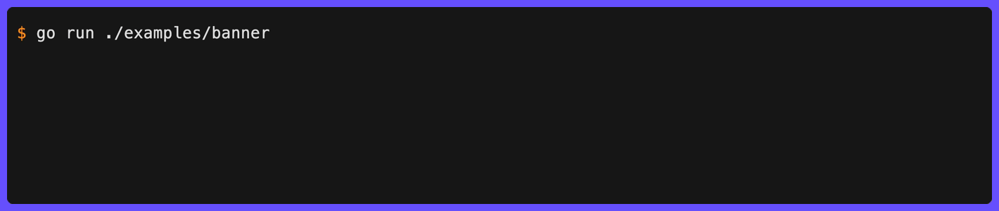

<h1 align="center"><code>clog</code></h1>

Structured CLI logging for Go with terminal-aware colours, hyperlinks, and animations. A [zerolog](https://github.com/rs/zerolog)-style fluent API designed for command-line tools.

## Demo

<p align="center">
  
</p>

## Installation

```sh
go get github.com/gechr/clog
```

## Quick Start

```go
package main

import (
  "fmt"

  "github.com/gechr/clog"
)

func main() {
  clog.Info().Str("port", "8080").Msg("Server started")
  clog.Warn().Str("path", "/old").Msg("Deprecated endpoint")
  err := fmt.Errorf("connection refused")
  clog.Error().Err(err).Msg("Connection failed")
}
```

Output:

```text
INF ℹ️ Server started port=8080
WRN ⚠️ Deprecated endpoint path=/old
ERR ❌ Connection failed error=connection refused
```

## Documentation

Full documentation is available at [gechr.github.io/clog](https://gechr.github.io/clog/).
