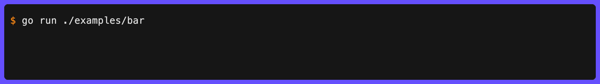
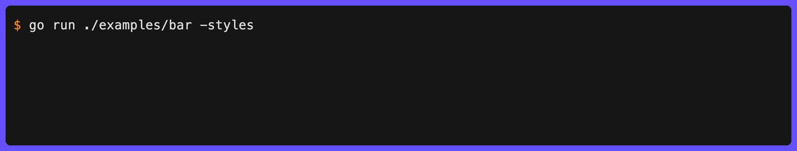

# Bar

`Bar` creates a determinate progress bar that shows filled/empty cells and a live percentage. Use `SetProgress` on the `Update` to advance the bar.



```go
err := clog.Bar("Downloading", 100).
  Str("file", "release.tar.gz").
  Elapsed("elapsed").
  Progress(ctx, func(ctx context.Context, p *clog.Update) error {
    for i := range 101 {
      p.SetProgress(i).Msg("Downloading").Send()
      time.Sleep(20 * time.Millisecond)
    }
    return nil
  }).
  Symbol("✅").
  Msg("Download complete")
// INF ⏳ Downloading [━━━━━━━━╸───────────] 42% elapsed=1.2s
// INF ✅ Download complete file=release.tar.gz elapsed=3.4s
```

`SetTotal` can be called mid-task to update the denominator if the total becomes known after the task starts:

```go
p.SetProgress(50).SetTotal(200).Msg("Processing").Send()
```

`AddTotal` atomically adds to the total - useful for "discovered more work" patterns where the full scope isn't known upfront:

```go
p.AddTotal(50)  // discovered 50 more items
p.AddTotal(-10) // 10 items turned out to be duplicates
```

`SetSymbol` changes the icon displayed beside the message during animation. This is useful for showing different phases of a multi-stage task:

```go
p.SetSymbol("📡").SetProgress(i).Str("stage", "receiving").Send()
p.SetSymbol("🔍").SetProgress(i).Str("stage", "resolving").Send()
```

If you don't want zero-progress tasks to show an empty bar, use `PendingHide`:

```go
clog.Bar("Cloning", 1, bar.WithPendingMode(bar.PendingHide))
```

This suppresses the entire bar block, including widgets, until progress becomes positive.

If frequent updates make ETA or rate text too jumpy, coalesce timing-derived widget and dynamic-field updates:

```go
clog.Bar("Cloning", 1, bar.WithUpdateInterval(time.Second))
```

This rate-limits timing-derived text such as ETA, rate, and elapsed while
leaving the bar fill, percent/current-total text, message, symbol, and other
live updates responsive.

## Styles

Seven pre-built styles are available in [`fx/bar/presets.go`](https://github.com/gechr/clog/blob/main/fx/bar/presets.go). Pass any of them via `bar.WithStyle()`:

| Preset         | Characters     | Description                                              |
| -------------- | -------------- | -------------------------------------------------------- |
| `bar.Basic`    | `[=====>    ]` | ASCII-only for maximum compatibility                     |
| `bar.Braille`  | `[⣿⣿⣿⣿⣿⣦⠀⠀⠀⠀]` | Braille dot-fill with 8x sub-cell resolution             |
| `bar.Dash`     | `[-----     ]` | Simple dash fill                                         |
| `bar.Thin`     | `[━━━╺──────]` | Box-drawing with half-cell resolution (default)          |
| `bar.Block`    | `│█████░░░░░│` | Solid block characters                                   |
| `bar.Gradient` | `│██████▍   │` | Block elements with 8x sub-cell resolution               |
| `bar.Smooth`   | `│████▌     │` | Block characters with half-block leading edge            |



```go
clog.Bar("Uploading", total, bar.WithStyle(bar.Smooth)).
  Progress(ctx, task).
  Msg("Done")
```

`bar.Thin` and `bar.Smooth` use half-cell resolution via `HalfFilled` (and `HalfEmpty` for `bar.Thin`), giving twice the visual granularity of full-cell styles. `bar.Gradient` and `bar.Braille` use `GradientFill` for 8x sub-cell resolution - the smoothest built-in options. `bar.Braille` is inspired by Docker Compose's progress display, using braille dot characters that progressively fill from bottom to top.

## Custom Style

Build a fully custom style by passing a `bar.WithStyle()` option:

```go
import "github.com/gechr/clog/fx/bar/widget"

clog.Bar("Uploading", total, bar.WithStyle(bar.Style{
    Placement:   bar.PlaceInline, // inline with message (default: bar.PlaceRightPad)

    CapStyle:    new(lipgloss.NewStyle().Bold(true)), // style for [ ] caps (default: bold white)
    CapLeft:     "|",
    CapRight:    "|",

    CharEmpty:   '-',
    CharFill:    '=',
    CharHead:    '>', // decorative head at leading edge (0 = disabled)

    HalfEmpty:   0, // half-cell trailing edge for 2x resolution (0 = disabled)
    HalfFilled:  0, // half-cell leading edge for 2x resolution (0 = disabled)

    Separator:   " ", // separator between message, bar, and widget text

    StyleEmpty:  new(lipgloss.NewStyle().Foreground(lipgloss.Color("8"))),  // grey
    StyleFill:   new(lipgloss.NewStyle().Foreground(lipgloss.Color("2"))),  // green

    WidgetLeft:  widget.Percent(widget.WithDigits(1)), // "50.0%" to the left of the bar
    WidgetRight: widget.None(), // suppress the default right-side percent

    Width:       30, // fixed inner width (0 = auto-size from terminal)
    WidthMin:    10, // auto-size minimum (default 10)
    WidthMax:    40, // auto-size maximum (default 40)
  })).
  Progress(ctx, task).
  Msg("Done")
```

When `Width` is 0, the bar auto-sizes to one quarter of the terminal width, clamped to `[WidthMin, WidthMax]`.

Any field can be overridden via option functions without building a full custom style:

```go
clog.Bar("Downloading", 100, bar.WithStyle(bar.Braille), bar.WithWidth(30))
```

### Structure

| Option                 | Description                                |
| ---------------------- | ------------------------------------------ |
| `bar.WithCapLeft(s)`   | Left cap string (e.g. `"["`, `"│"`)        |
| `bar.WithCapRight(s)`  | Right cap string (e.g. `"]"`, `"│"`)       |
| `bar.WithCapStyle(ls)` | Lipgloss style for caps (`nil` = unstyled) |
| `bar.WithSeparator(s)` | String between message, bar, and widgets   |

### Characters

| Option                     | Description                                          |
| -------------------------- | ---------------------------------------------------- |
| `bar.WithCharEmpty(r)`     | Rune for fully empty cells                           |
| `bar.WithCharFill(r)`      | Rune for fully filled cells                          |
| `bar.WithCharHead(r)`      | Decorative rune at leading edge (1x only; `0` = off) |
| `bar.WithHalfFilled(r)`    | Leading-edge rune for 2x resolution (`0` = off)      |
| `bar.WithHalfEmpty(r)`     | Trailing-edge rune for 2x resolution (`0` = off)     |
| `bar.WithGradientFill(rs)` | Sub-cell runes (least→most filled) for Nx resolution |

### Width

| Option                | Description                           |
| --------------------- | ------------------------------------- |
| `bar.WithWidth(n)`    | Fixed inner width (`0` = auto-size)   |
| `bar.WithWidthMin(n)` | Minimum auto-sized width (default 10) |
| `bar.WithWidthMax(n)` | Maximum auto-sized width (default 40) |

### Colors

| Option                          | Description                                    |
| ------------------------------- | ---------------------------------------------- |
| `bar.WithStyleFill(ls)`         | Lipgloss style for filled cells                |
| `bar.WithStyleEmpty(ls)`        | Lipgloss style for empty cells                 |
| `bar.WithProgressGradient(...)` | Color fill by progress (overrides `StyleFill`) |

### Widgets

| Option                      | Description                                                               |
| --------------------------- | ------------------------------------------------------------------------- |
| `bar.WithWidgetLeft(w)`     | Widget displayed to the left of the bar                                   |
| `bar.WithWidgetRight(w)`    | Widget displayed to the right of the bar                                  |
| `bar.WithPlacement(p)`      | Horizontal bar placement mode                                             |
| `bar.WithPendingMode(m)`    | Whether to render the bar before progress starts                          |
| `bar.WithUpdateInterval(d)` | Coalesce ETA/rate/elapsed-style text updates to at most once per duration |

All presets use bold white `CapStyle`. Pass `bar.WithCapStyle(nil)` for unstyled caps.

## Progress Gradient

Color the bar fill based on progress using `ProgressGradient`. The filled portion shifts through the gradient as progress advances (e.g. red at 0%, yellow at 50%, green at 100%):

```go
style := bar.Block
style.ProgressGradient = bar.DefaultGradient() // red → yellow → green

clog.Bar("Building", 100, bar.WithStyle(style)).
  Progress(ctx, task).
  Msg("Built")
```

Custom gradients work the same as other gradient fields:

```go
style.ProgressGradient = []style.ColorStop{
  {Position: 0, Color: colorful.Color{R: 0.3, G: 0.3, B: 1}},   // blue
  {Position: 0.5, Color: colorful.Color{R: 1, G: 1, B: 1}},     // white
  {Position: 1, Color: colorful.Color{R: 0.3, G: 1, B: 0.3}},   // green
}
```

When set, `ProgressGradient` overrides the `StyleFill` foreground color. Use `bar.DefaultGradient()` to get the default red → yellow → green stops.

## Alignment

The `Placement` field on `bar.Style` controls where the bar appears on the line:

| Constant              | Layout                                                                 |
| --------------------- | ---------------------------------------------------------------------- |
| `bar.PlaceRightPad`   | `INF ⏳ Downloading                     [━━━━━╸╺──────] 45%` (default) |
| `bar.PlaceLeftPad`    | `INF ⏳ [━━━━━╸╺──────] 45%                     Downloading`           |
| `bar.PlaceInline`     | `INF ⏳ Downloading [━━━━━╸╺──────] 45%`                               |
| `bar.PlaceRight`      | `INF ⏳ Downloading [━━━━━╸╺──────] 45%`                               |
| `bar.PlaceLeft`       | `INF ⏳ [━━━━━╸╺──────] 45% Downloading`                               |

The padded variants (`bar.PlaceRightPad`, `bar.PlaceLeftPad`) fill the gap between message and bar with spaces to span the terminal width. When the terminal is too narrow, they fall back to the `Separator` between parts.

## Widgets

`WidgetLeft` and `WidgetRight` on `bar.Style` control text annotations beside the bar. Each is a `bar.Widget` - a callback that receives progress state and returns a string:

```go
type bar.State struct {
  Current int
  Total   int
  Elapsed time.Duration
  Rate    float64 // items per second
}
type bar.Widget func(bar.State) string
```

All presets set `WidgetRight: widget.Percent()` - padded percentage on the right (e.g. `" 42%"`). When both widgets are `nil`, the same default applies.

**Built-in widgets:**

| Widget                | Description                                                       |
| --------------------- | ----------------------------------------------------------------- |
| `widget.Percent(...)` | Padded percentage (use `widget.WithDigits(n)` for decimal places) |
| `widget.Bytes()`      | SI byte progress (e.g. `" 50 MB / 100 MB"`, base-1000)            |
| `widget.IBytes()`     | IEC byte progress (e.g. `"50 MiB / 100 MiB"`, base-1024)          |
| `widget.ETA()`        | Estimated time remaining (e.g. `"ETA 2m30s"`, `"ETA ∞"`)          |
| `widget.Rate()`       | Items per second (e.g. `"150/s"`, `"1.5k/s"`)                     |
| `widget.BytesRate()`  | SI byte throughput (e.g. `"82.9 MB/s"`)                           |
| `widget.IBytesRate()` | IEC byte throughput (e.g. `"82.9 MiB/s"`)                         |
| `widget.None()`       | Always returns "" - suppresses default percent                    |
| `widget.Separator(s)` | Always renders `s` - use as a divider inside `widget.Widgets`     |

All widget constructors accept `widget.Option` values:

| Option                   | Applies to                                                                                 | Description                                                                     |
| ------------------------ | ------------------------------------------------------------------------------------------ | ------------------------------------------------------------------------------- |
| `widget.WithDigits(n)`   | `widget.Percent`, `widget.Bytes`, `widget.IBytes`, `widget.BytesRate`, `widget.IBytesRate` | Precision: significant digits or decimal places                                 |
| `widget.WithUnit(label)` | `widget.Rate`                                                                              | Unit label (e.g. `"ops"` → `"150 ops/s"`)                                       |
| `widget.WithStyle(s)`    | all widgets                                                                                | [Lipgloss](https://charm.land/lipgloss/v2) style applied to the widget's output |

**Composing multiple widgets:**

Use `widget.Widgets` to combine several widgets on a single side. Empty outputs are filtered and the rest are joined with a space:

```go
style := bar.Thin
style.WidgetRight = widget.Widgets(widget.ETA(), widget.Rate())
// INF ⏳ Processing [━━━━━╸╺──────] ETA 2m30s 150/s
```

Add a visual divider with `widget.Separator`:

```go
style.WidgetRight = widget.Widgets(
  widget.ETA(),
  widget.Separator("│"),
  widget.Rate(),
)
// INF ⏳ Processing [━━━━━╸╺──────] ETA 2m30s │ 150/s
```

Pass `widget.WithStyle` to any widget to apply a [Lipgloss](https://charm.land/lipgloss/v2) style to its output:

```go
faint := new(lipgloss.NewStyle().Faint(true))
style.WidgetRight = widget.Widgets(
  widget.ETA(widget.WithStyle(faint)),
  widget.Separator("│", widget.WithStyle(faint)),
  widget.Rate(widget.WithStyle(faint)),
)
// INF ⏳ Processing [━━━━━╸╺──────] ETA 2m30s │ 150/s  (all rendered faint)
```

**Move percent to the left:**

```go
style := bar.Thin
style.WidgetLeft = widget.Percent()
style.WidgetRight = widget.None()
```

**Download progress with byte sizes:**

```go
fileSize := 150 * 1000 * 1000 // 150 MB
style := bar.Smooth
style.WidgetRight = widget.Bytes()

clog.Bar("Downloading", fileSize, bar.WithStyle(style)).
  Str("file", "model.bin").
  Progress(ctx, func(ctx context.Context, p *clog.Update) error {
    // p.SetProgress(bytesReceived).Send()
  }).
  Msg("Downloaded")
// INF ⏳ Downloading │████▌     │  75 MB / 150 MB file=model.bin
```

The current value is right-aligned to the total's width to prevent the bar from jumping as digits change. Use `widget.IBytes()` for base-1024 units (KiB, MiB, GiB).

**ETA and rate:**

```go
style := bar.Block
style.WidgetLeft = widget.ETA()
style.WidgetRight = widget.Rate(widget.WithUnit("items"))

clog.Bar("Processing", 500, bar.WithStyle(style)).
  Progress(ctx, task).
  Msg("Done")
// INF ⏳ Processing ETA 2m30s │█████░░░░░│ 150 items/s
```

`widget.ETA` shows `"ETA ∞"` before any progress, a countdown during the task, and `""` when complete. `widget.Rate` accepts an optional `widget.WithUnit` for a label; without it, output is `"150/s"`.

**Byte throughput:**

```go
style := bar.Gradient
style.WidgetRight = widget.BytesRate()

clog.Bar("Uploading", totalBytes, bar.WithStyle(style)).
  Progress(ctx, task).
  Msg("Done")
// INF ⏳ Uploading │██████▍   │ 82.9 MB/s
```

Use `widget.IBytesRate()` for IEC units (`MiB/s`). Both accept `widget.WithDigits(n)` to control significant digits (default 3).

**Custom widget:**

```go
style := bar.Thin
style.WidgetRight = func(s bar.State) string {
  remaining := s.Total - s.Current
  return fmt.Sprintf("%d remaining", remaining)
}
```

**Suppress percent entirely:**

```go
style := bar.Thin
style.WidgetRight = widget.None()
```

## Percentage as a Field

Use `.BarPercent(key)` on the builder to move the percentage into structured fields. This suppresses the default right-side widget:

```go
clog.Bar("Installing", 100).
  BarPercent("progress").
  Elapsed("elapsed").
  Progress(ctx, task).
  Msg("Installed")
// INF ⏳ Installing          [━━━━━╸╺──────] progress=45% elapsed=1.2s
```

All animations gracefully degrade: when colors are disabled (CI, piped output), a static status line with an ⏳ symbol is printed instead.

The icon displayed during `Pulse`, `Shimmer`, and `Bar` animations defaults to ⏳ and can be changed with `.Symbol()` on the builder (before the task starts) or `SetSymbol()` on the `Update` (during the task):

```go
clog.Pulse("Warming up").
  Symbol("🔄").
  Wait(ctx, action).
  Msg("Ready")
```
