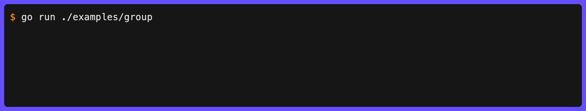

# Group

`Group` runs multiple animations concurrently in a multi-line block, redrawn in place each tick (frames are skipped when nothing changed, and repaints use synchronized output on terminals that support it).



```go
g := clog.Group(ctx)
g.Add(clog.Spinner("Processing data").Int("workers", 4)).
  Run(func(ctx context.Context) error {
    return processData(ctx)
  })
g.Add(clog.Bar("Downloading", 100)).
  Progress(func(ctx context.Context, p *clog.Update) error {
    for i := range 101 {
      p.SetProgress(i).Send()
      time.Sleep(20 * time.Millisecond)
    }
    return nil
  })
g.Wait().Symbol("✅").Msg("All tasks complete")
```

Group options live in the `fx` package (`github.com/gechr/clog/fx`). To align the first field column across rows, enable group field alignment:

```go
g := clog.Group(ctx, fx.WithFieldAlignment(fx.FieldAlignmentMessage))
```

To let `clog` limit how many tasks run at once, use `WithParallelism`:

```go
g := clog.Group(ctx, fx.WithParallelism(5))
```

By default, all animations in a group share a common epoch so spinners, pulses, and shimmers stay in lockstep regardless of when each task starts. To let each task animate from its own start time instead, disable sync:

```go
g := clog.Group(ctx, fx.WithoutSyncAnimations())
```

To keep grouped bar fills and their percentage text from visibly moving backward when task totals grow or progress is reported in phases, enable monotonic mode:

```go
g := clog.Group(ctx, fx.WithMonotonic())
```

When the context is cancelled (e.g. on `SIGINT`), the last rendered frame is preserved so the user can see what was on screen. To clear the block instead, use `WithClearOnCancel`:

```go
g := clog.Group(ctx, fx.WithClearOnCancel())
```

To hide completed tasks from the rendered block so only active and pending tasks remain visible, use `WithHideDone`:

```go
g := clog.Group(ctx, fx.WithHideDone())
```

To add a header or footer status line that updates each tick, use `WithHeader` or `WithFooter`. Pass a builder for the initial config (level, symbol, parts) and a callback that updates the message and fields each tick:

```go
g := clog.Group(ctx,
  fx.WithHideDone(),
  fx.WithFooter(
    clog.Spinner("Cloned"),
    func(done, total int, u *clog.Update) {
      u.Msg("Cloned").Str("progress", fmt.Sprintf("%d/%d", done, total)).Send()
    },
  ),
)
```

While the tasks run, the terminal shows all animations updating simultaneously:

```text
INF 🌒 Processing data workers=4
INF ⏳ Downloading ━━━━━━━━━╸╺━━━━━━━━━━━ 42%
```

When all tasks finish, the block is cleared and a single summary line is logged. Alternatively, use per-task results for individual completion messages:

```go
g := clog.Group(ctx)
proc := g.Add(clog.Spinner("Processing")).Run(processData)
dl := g.Add(clog.Bar("Downloading", 100)).Progress(download)
g.Wait()
proc.Symbol("✅").Msg("Processing done")
dl.Symbol("✅").Msg("Download complete")
```

Any mix of animation types works: spinners, bars, pulses, and shimmers can all run in the same group.

## API

| Function / Method                | Description                                                  |
| -------------------------------- | ------------------------------------------------------------ |
| `clog.Group(ctx)`                | Create a group using the `Default` logger                    |
| `logger.Group(ctx)`              | Create a group using a specific logger                       |
| `fx.WithClearOnCancel()`         | Clear the rendered block on context cancellation             |
| `fx.WithFieldAlignment(mode)`    | Align the first field column in grouped output               |
| `fx.WithFooter(b, fn)`           | Add a status line below the task block, updated each tick    |
| `fx.WithHeader(b, fn)`           | Add a status line above the task block, updated each tick    |
| `fx.WithHideDone()`              | Remove completed tasks from the rendered block               |
| `fx.WithMaxHeightPercent(pct)`   | Cap the group block to a percentage of terminal height       |
| `fx.WithMaxLines(n)`             | Cap the number of visible lines in the group render block    |
| `fx.WithMonotonic()`             | Clamp grouped bars and percent to the highest shown fraction |
| `fx.WithOverflowIndicator(...)`  | Append an `… N more` line when the height cap hides tasks    |
| `fx.WithParallelism(n)`          | Limit how many group tasks may execute concurrently          |
| `fx.WithoutSyncAnimations()`     | Let each task animate from its own start time (sync default) |
| `g.Add(builder)`                 | Register an animation builder, returns `*GroupEntry`         |
| `entry.Run(task)`                | Start a `TaskFunc`, returns `*TaskResult`                    |
| `entry.Progress(task)`           | Start an `UpdateFunc`, returns `*TaskResult`                 |
| `g.Wait()`                       | Block until all tasks complete, returns `*GroupResult`       |

`FieldAlignmentMessage` applies when `PartFields` comes immediately after `PartMessage` in the part order, which is the default layout.

`WithFooter(b, fn)` and `WithHeader(b, fn)` take a `*fx.Builder` for initial config (level, symbol, parts) and a `GroupStatusFunc` callback `func(done, total int, u *Update)` called each render tick. The callback uses the `Update` to set the message and fields. Header and footer lines count towards the terminal height cap.

`WithHideDone()` removes completed tasks from the rendered block so only active and pending tasks are visible. Bar alignment layout only considers visible tasks.

`WithMaxHeightPercent(percent)` caps the group block to a fraction of the terminal height (e.g. `0.5` for half). Clamped to (0, 1]. When both `WithMaxLines` and `WithMaxHeightPercent` are set, the smaller wins.

`WithMaxLines(n)` caps the visible lines in the group block. When set, this takes precedence over the automatic terminal height cap. Header and footer lines count towards this limit. Values less than or equal to zero are ignored.

When the terminal height (or an explicit cap) leaves some tasks unrendered, they are dropped silently by default. `WithOverflowIndicator()` instead appends an `… N more` overflow indicator line counting the hidden tasks, styled like a status line through the group's logger. The indicator consumes one row of the budget and only renders when at least one task row remains above it. Tasks hidden by `WithHideDone` are not counted - only tasks that would render if there were room. The message text and style are configurable via sub-options:

```go
g := clog.Group(ctx, fx.WithMaxLines(4), fx.WithOverflowIndicator(
  fx.WithOverflowText(func(hidden int) string {
    return fmt.Sprintf("and %d more…", hidden)
  }),
  fx.WithOverflowStyle(new(lipgloss.NewStyle().Faint(true))),
))
```

`WithMonotonic()` clamps the rendered bar fill, percentage text, and widget values to the highest fraction seen so far. It does not change the underlying task progress values.

`WithParallelism(n)` removes the limit when `n <= 0`.

Animation sync (the default) records a shared epoch when the render loop starts. Spinner frame indices, pulse sine phase, and shimmer scroll phase are all derived from this epoch instead of each task's individual start time, so animations stay in lockstep. Elapsed-time fields remain per-task and freeze at each task's finish time, so a completed line reports the task's actual runtime while its siblings continue. `WithoutSyncAnimations()` disables this and lets each task animate from its own start time.

`GroupResult` and `TaskResult` support the same chaining as `WaitResult`: `.Msg()`, `.Parts()`, `.Symbol()`, `.Send()`, `.Err()`, `.Silent()`, `.OnErrorLevel()`, `.OnErrorMessage()`, `.OnSuccessLevel()`, `.OnSuccessMessage()`, and all field methods (`.Str()`, `.Int()`, etc.).

## Per-Event Parts Override

Override the [part order](part-order.md) for individual animations and their completion messages:

```go
g := clog.Group(ctx)

// Animation + completion both use overridden parts.
proc := g.Add(clog.Spinner("Processing").Parts(clog.PartMessage)).
  Run(processData)

dl := g.Add(clog.Bar("Downloading", 100)).
  Progress(download)

// Override parts only on the summary line.
g.Wait().Parts(clog.PartSymbol, clog.PartMessage).Msg("All done")
```

`.Parts()` on the animation propagates to the `TaskResult`. Call `.Parts()` on `TaskResult` or `GroupResult` to override independently for the completion message.

`GroupResult.Err()` / `.Silent()` returns the `errors.Join` of all task errors (nil when all succeeded).
