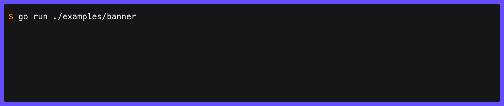

# clog

A highly customizable structured logger for command-line tools with a [zerolog](https://github.com/rs/zerolog)-inspired fluent API, terminal-aware colors, hyperlinks, and animations.



## Features

- **[Structured fields](structured-fields.md)** - typed field methods (`Str`, `Int`, `Bool`, `Duration`, `JSON`, …) with a fluent builder API
- **[Animations](spinner.md)** - [spinners](spinner.md), [progress bars](bar.md), [pulse](pulse.md), and [shimmer](shimmer.md) effects with [concurrent groups](group.md)
- **[Hyperlinks](hyperlinks.md)** - clickable file paths and URLs via OSC 8, with [IDE presets](hyperlinks.md#named-presets) for VS Code, Cursor, Sublime, and more
- **[JSON highlighting](json.md)** - syntax-highlighted JSON output with configurable rendering modes
- **[Styling](styles.md)** - full visual customisation via [lipgloss](https://charm.land/lipgloss/v2), including per-key, per-value, and per-type colors
- **[`log/slog` integration](slog.md)** - drop-in `slog.Handler` backed by clog
- **[`NO_COLOR`](no-color.md)** - respects the `NO_COLOR` convention out of the box

## Installation

```sh
go get github.com/gechr/clog
```

## Quick Start

```go
package main

import (
  "fmt"

  "github.com/gechr/clog"
)

func main() {
  clog.Info().Str("port", "8080").Msg("Server started")
  clog.Warn().Str("path", "/old").Msg("Deprecated endpoint")
  err := fmt.Errorf("connection refused")
  clog.Error().Err(err).Msg("Connection failed")
}
```

Output:

```text
INF ℹ️ Server started port=8080
WRN ⚠️ Deprecated endpoint path=/old
ERR ❌ Connection failed error=connection refused
```
