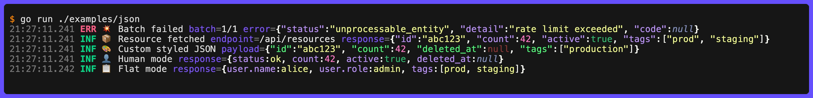

# JSON

`JSON` marshals any Go value to JSON; `RawJSON` accepts pre-serialized bytes. Both emit the result with syntax highlighting.



```go
// Marshal a Go value
clog.Info().JSON("user", userStruct).Msg("ok")
clog.Info().JSON("config", map[string]any{"port": 8080, "debug": true}).Msg("started")

// Pre-serialized bytes (no marshal overhead)
clog.Error().
  Str("batch", "1/1").
  RawJSON("error", []byte(`{"status":"unprocessable_entity","detail":"validation failed","code":null}`)).
  Msg("Batch failed")
// ERR ❌ Batch failed batch=1/1 error={"status":"unprocessable_entity","detail":"validation failed","code":null}
```

Use `JSON` when you have a Go value to log; use `RawJSON` when you already have bytes (HTTP response bodies, `json.RawMessage`, database JSON columns) to avoid an unnecessary marshal/unmarshal round-trip. `JSON` logs the error string as the field value if marshalling fails.

Pretty-printed JSON is automatically flattened to a single line. Highlighting uses a Dracula-inspired color scheme by default (space after commas included). Disable or customise it via `FieldJSON` in `Styles`:

```go
// Disable highlighting
styles := clog.DefaultStyles()
styles.FieldJSON = nil
clog.SetStyles(styles)

// Custom colors
custom := style.DefaultJSON()
custom.Key = new(lipgloss.NewStyle().Foreground(lipgloss.Color("#50fa7b")))
styles.FieldJSON = custom
clog.SetStyles(styles)
```

`Number` is the base fallback for all numeric tokens. Five sub-styles allow finer control and fall back to `Number` when nil:

| Field            | Applies to                                           |
| ---------------- | ---------------------------------------------------- |
| `NumberPositive` | Positive numbers (with or without explicit `+`)      |
| `NumberNegative` | Negative numbers                                     |
| `NumberZero`     | Zero (falls back to `NumberPositive`, then `Number`) |
| `NumberFloat`    | Floating-point values                                |
| `NumberInteger`  | Integer values                                       |

```go
custom := style.DefaultJSON()
custom.NumberNegative = new(lipgloss.NewStyle().Foreground(lipgloss.Color("1"))) // red
custom.NumberZero = new(lipgloss.NewStyle().Foreground(lipgloss.Color("8")))     // grey
styles.FieldJSON = custom
clog.SetStyles(styles)
```

## Rendering Modes

Set `style.JSON.Mode` to control how JSON structure is rendered:

| Mode                  | Description                                                      | Example                              |
| --------------------- | ---------------------------------------------------------------- | ------------------------------------ |
| `style.JSONModeJSON`  | Standard JSON (default)                                          | `{"status":"ok","count":42}`         |
| `style.JSONModeHuman` | Unquote keys and simple string values                            | `{status:ok, count:42}`              |
| `style.JSONModeFlat`  | Flatten nested object keys with dot notation; arrays kept intact | `{status:ok, meta.region:us-east-1}` |

**`style.JSONModeHuman`** - keys are unquoted unless they contain `,{}[]\s:#"'` or start with `//`/`/*`. String values are unquoted unless they start with a forbidden character, end with whitespace, are ambiguous as a JSON keyword (`true`, `false`, `null`), or look like a number. Empty strings always render as `""`.

```go
styles.FieldJSON = style.DefaultJSON()
styles.FieldJSON.Mode = style.JSONModeHuman

clog.Info().
  RawJSON("response", []byte(`{"status":"ok","count":42,"active":true,"deleted_at":null}`)).
  Msg("Fetched")
// INF ℹ️ Fetched response={status:ok, count:42, active:true, deleted_at:null}
```

**`style.JSONModeFlat`** - nested objects are recursed into and their keys joined with `.`; arrays are kept intact as values:

```go
styles.FieldJSON.Mode = style.JSONModeFlat

clog.Info().
  RawJSON("resp", []byte(`{"user":{"name":"alice","role":"admin"},"tags":["a","b"]}`)).
  Msg("Auth")
// INF ℹ️ Auth resp={user.name:alice, user.role:admin, tags:[a, b]}
```

## Spacing

`style.JSON.Spacing` is a bitmask controlling where spaces are inserted. The default (`style.DefaultJSON`) adds a space after commas.

| Flag                            | Effect                    | Example                            |
| ------------------------------- | ------------------------- | ---------------------------------- |
| `style.JSONSpacingAfterColon`   | Space after `:`           | `{"key": "value"}`                 |
| `style.JSONSpacingAfterComma`   | Space after `,`           | `{"a":1, "b":2}`                   |
| `style.JSONSpacingBeforeObject` | Space before a nested `{` | `{"key": {"n":1}}`                 |
| `style.JSONSpacingBeforeArray`  | Space before a nested `[` | `{"tags": ["a","b"]}`              |
| `style.JSONSpacingAll`          | All of the above          | `{"key": {"n": 1}, "tags": ["a"]}` |

```go
// Fluent builder
styles.FieldJSON = style.DefaultJSON().WithSpacing(style.JSONSpacingAll)

// Direct assignment
styles.FieldJSON.Spacing = style.JSONSpacingAfterComma | style.JSONSpacingBeforeObject
```

`style.JSONSpacingAfterColon` and `style.JSONSpacingBeforeObject`/`style.JSONSpacingBeforeArray` are independent - combining them produces two spaces before a nested value.

## Omitting Commas

Set `OmitCommas: true` to drop the `,` separator. Combine with `style.JSONSpacingAfterComma` to keep a space in its place:

```go
styles.FieldJSON.OmitCommas = true
styles.FieldJSON.Spacing |= style.JSONSpacingAfterComma

clog.Info().
  RawJSON("r", []byte(`{"a":1,"b":2,"c":true}`)).
  Msg("ok")
// INF ℹ️ ok r={a:1 b:2 c:true}
```
