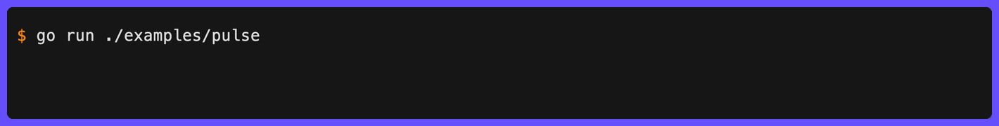

# Pulse

`Pulse` creates an independent animation where all characters in the message fade uniformly between gradient colors.



```go
// Default gradient (blue-gray to cyan)
clog.Pulse("Warming up").
  Wait(ctx, action).
  Msg("Ready")

// Custom gradient
clog.Pulse("Replicating",
  pulse.WithGradient(
    style.ColorStop{Position: 0, Color: colorful.Color{R: 1, G: 0.2, B: 0.2}},
    style.ColorStop{Position: 0.5, Color: colorful.Color{R: 1, G: 1, B: 0.3}},
    style.ColorStop{Position: 1, Color: colorful.Color{R: 1, G: 0.2, B: 0.2}},
  ),
).
  Wait(ctx, action).
  Msg("Replicated")

// Custom speed (2× faster)
clog.Pulse("Processing",
  pulse.WithSpeed(1.0),
).
  Wait(ctx, action).
  Msg("Done")
```

Use `pulse.DefaultStyle()` to inspect the default configuration, or `pulse.DefaultGradient()` to get just the default gradient stops.
