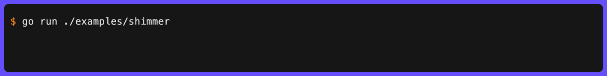
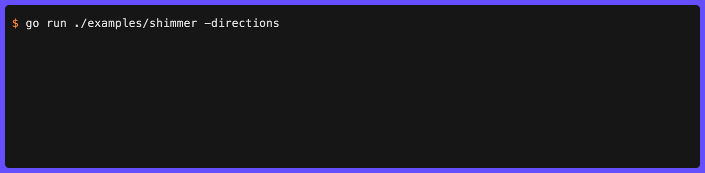

# Shimmer

`Shimmer` creates an independent animation where each character is colored based on its position in a sweeping gradient wave.



```go
// Default gradient
clog.Shimmer("Indexing documents").
  Wait(ctx, action).
  Msg("Indexed")

// Custom gradient with direction
clog.Shimmer("Synchronizing",
  shimmer.WithGradient(
    style.ColorStop{Position: 0, Color: colorful.Color{R: 0.3, G: 0.3, B: 0.8}},
    style.ColorStop{Position: 0.5, Color: colorful.Color{R: 1, G: 1, B: 1}},
    style.ColorStop{Position: 1, Color: colorful.Color{R: 0.3, G: 0.3, B: 0.8}},
  ),
  shimmer.WithDirection(shimmer.MiddleIn),
).
  Wait(ctx, action).
  Msg("Synchronized")
```

Use `shimmer.DefaultGradient()` to get the default gradient stops.

## Directions

| Constant            | Description                              |
| ------------------- | ---------------------------------------- |
| `shimmer.Right`     | Left to right (default)                  |
| `shimmer.Left`      | Right to left                            |
| `shimmer.MiddleIn`  | Inward from both edges                   |
| `shimmer.MiddleOut` | Outward from the center                  |
| `shimmer.BounceIn`  | Inward from both edges, then bounces out |
| `shimmer.BounceOut` | Outward from center, then bounces in     |



## Speed

Control how fast the animation cycles with `shimmer.WithSpeed(cyclesPerSecond)`. The default is `0.5` (one full cycle every two seconds). Values ≤ 0 are treated as the default.

```go
clog.Shimmer("Fast shimmer",
  shimmer.WithSpeed(2.0),  // 2 gradient cycles per second
).
  Wait(ctx, action).
  Msg("Done")

clog.Pulse("Quick pulse", pulse.WithSpeed(1.5)).
  Wait(ctx, action).
  Msg("Done")
```

Both pulse and shimmer use `ColorStop` for gradient definitions:

```go
type ColorStop struct {
  Position float64        // 0.0-1.0
  Color    colorful.Color // from github.com/lucasb-eyer/go-colorful
}
```
