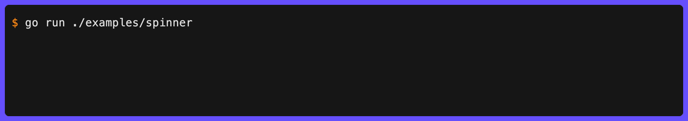
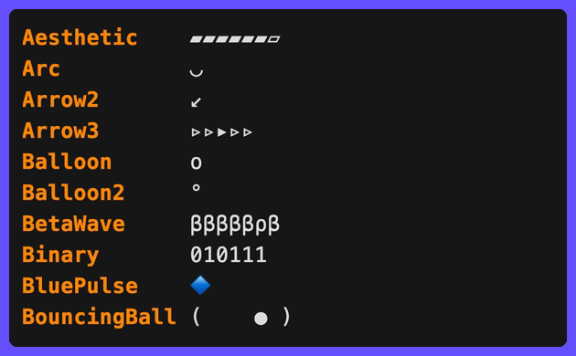
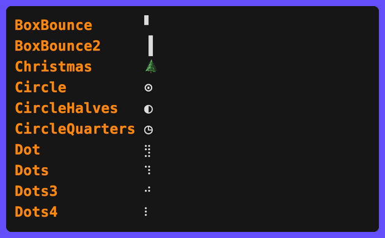
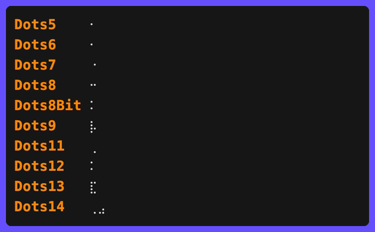
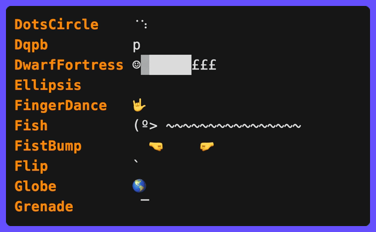
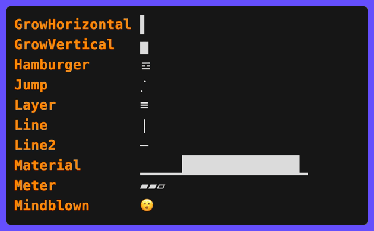
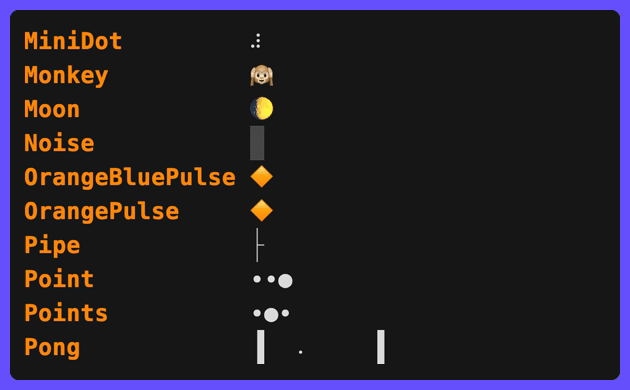
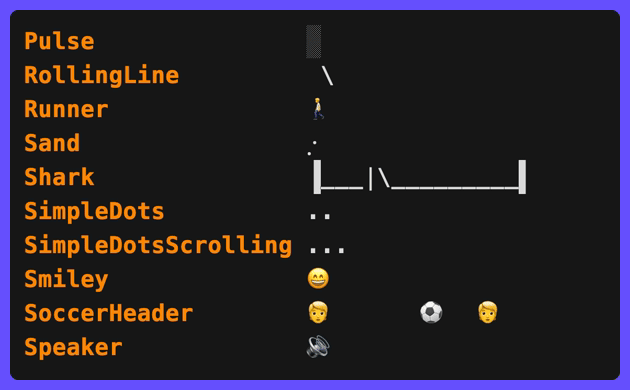
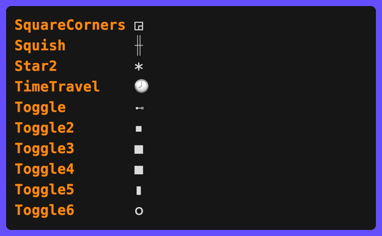
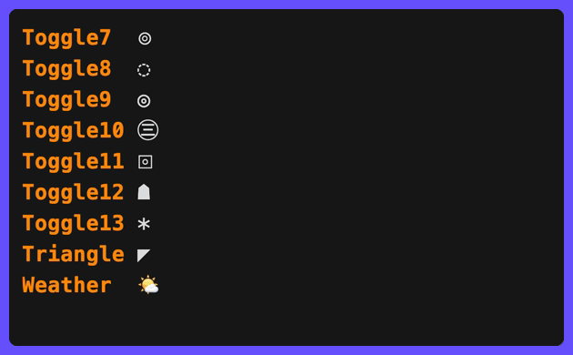

# Spinner

Display animated spinners during long-running operations:

```go
err := clog.Spinner("Downloading").
  Str("url", fileURL).
  Wait(ctx, func(ctx context.Context) error {
    return download(ctx, fileURL)
  }).
  Msg("Downloaded")
```

The spinner animates with moon phase emojis (🌔🌓🌒🌑🌘🌗🌖🌕) while the action runs, then logs the result. This is the default style ([`spinner.DefaultStyle`](https://pkg.go.dev/github.com/gechr/clog/fx/spinner#DefaultStyle)), which is used when no `spinner.WithStyle` option is passed.



## Dynamic Status Updates

Use `Progress` to update the spinner message and fields during execution:

```go
err := clog.Spinner("Processing").
  Progress(ctx, func(ctx context.Context, update *clog.Update) error {
    for i, item := range items {
      update.Msg("Processing").Str("progress", fmt.Sprintf("%d/%d", i+1, len(items))).Send()
      if err := process(ctx, item); err != nil {
        return err
      }
    }
    return nil
  }).
  Msg("Processed all items")
```

## WaitResult Finalisers

| Method      | Success behaviour                  | Failure behaviour                      |
| ----------- | ---------------------------------- | -------------------------------------- |
| `.Msg(s)`   | Logs at `INF` with message         | Logs at `ERR` with error string        |
| `.Err()`    | Logs at `INF` with spinner message | Logs at `ERR` with error string as msg |
| `.Send()`   | Logs at configured level           | Logs at configured level               |
| `.Silent()` | Returns error, no logging          | Returns error, no logging              |

`.Err()` is equivalent to calling `.Send()` with default settings (no `OnSuccess`/`OnError` overrides).

All finalisers return the `error` from the action. You can chain any field method (`.Str()`, `.Int()`, `.Bool()`, `.Duration()`, etc.) and `.Symbol()` on a `WaitResult` before finalising.

## Custom Success/Error Behaviour

Use `OnSuccessLevel`, `OnSuccessMessage`, `OnErrorLevel`, and `OnErrorMessage` to customise how the result is logged, then call `.Send()`:

```go
// Fatal on error instead of the default error level
err := clog.Spinner("Connecting to database").
  Str("host", "db.internal").
  Wait(ctx, connectToDB).
  OnErrorLevel(clog.LevelFatal).
  Send()
```

When `OnErrorMessage` is set, the custom message becomes the log message and the original error is included as an `error=` field. Without it, the error string is used directly as the message with no extra field.

## Custom Spinner Style

```go
clog.Spinner("Loading", spinner.WithStyle(spinner.Dot)).
  Wait(ctx, action).
  Msg("Done")
```

See [`fx/spinner/presets.go`](https://github.com/gechr/clog/blob/main/fx/spinner/presets.go) for the full list of available spinner types.

Individual style properties can be overridden without replacing the entire style:

| Option                    | Description                                                  |
| ------------------------- | ------------------------------------------------------------ |
| `spinner.WithFrames(fs)`  | Animation frames (e.g. `[]string{"⠋","⠙","⠹","⠸"}`)          |
| `spinner.WithInterval(d)` | Duration per frame (values ≤ 0 keep existing)                |
| `spinner.WithBoomerang()` | Ping-pong playback - reverses at each end instead of jumping |
| `spinner.WithReverse()`   | Play frames in reverse order                                 |

```go
// Custom frames with a slower tick
clog.Spinner("Loading",
  spinner.WithFrames([]string{"⠋", "⠙", "⠹", "⠸", "⠼", "⠴", "⠦", "⠧", "⠇", "⠏"}),
  spinner.WithInterval(120*time.Millisecond),
).
  Wait(ctx, action).
  Msg("Done")
```

<div style="display: flex; flex-wrap: wrap; gap: 8px;">
  
  
  
  
  
  
  
  
  
</div>

## Hyperlink Fields on Animations

Animations support the same clickable hyperlink field methods as events:

```go
clog.Spinner("Building").
  Path("dir", "src/").
  Line("config", "config.yaml", 42).
  Column("loc", "main.go", 10, 5).
  URL("docs", "https://example.com").
  Link("help", "https://example.com", "docs").
  Wait(ctx, action).
  Msg("Built")
```

## Elapsed Timer

Add a live elapsed-time field to any animation with `.Elapsed(key)`:

```go
err := clog.Spinner("Processing batch").
  Str("batch", "1/3").
  Elapsed("elapsed").
  Int("workers", 4).
  Wait(ctx, processBatch).
  Msg("Batch processed")
// INF ✅ Batch processed batch=1/3 elapsed=2s workers=4
```

The elapsed field respects its position relative to other field methods - it appears between `batch` and `workers` in the output above because `.Elapsed("elapsed")` was called between `.Str()` and `.Int()`.

The display format uses `SetElapsedPrecision` (default 0 decimal places), rounds to `SetElapsedRound` (default 1s), hides values below `SetElapsedMinimum` (default 1s), and can be fully overridden with `SetElapsedFormatFunc`. Durations >= 1m use composite format (e.g. "1m30s", "2h15m").

## Per-Event Parts Override

Override the [part order](part-order.md) for a spinner and its completion message without mutating the logger:

```go
err := clog.Spinner("Indexing files").
  Parts(clog.PartSymbol, clog.PartMessage).
  Wait(ctx, indexFiles).
  Msg("Indexed")
// ✅ Indexed   (no level label or fields)
```

When set on animations, the override applies to both the animation rendering and the default completion message. You can further override on the `WaitResult` if the completion needs different parts:

```go
clog.Spinner("Syncing").
  Parts(clog.PartMessage).          // animation: message only
  Wait(ctx, sync).
  Parts(clog.PartLevel, clog.PartMessage).  // completion: add level back
  Msg("Synced")
```

## Non-TTY Silent

By default, animations print a static status line on non-TTY writers (CI, piped output) so the user knows something is in progress. Use `NonTTYSilent` to suppress this line entirely - the task still runs, only the output is hidden:

```go
err := clog.Spinner("Reticulating splines").
  NonTTYSilent(true).
  Wait(ctx, reticulateSplines).
  Msg("Splines reticulated")
```

On a terminal, the spinner animates normally. When piped, no output is produced until the completion message.

This is useful for decorative animations that add noise in CI logs. For level-based suppression across all animations, see [`SetNonTTYLevel`](levels.md#non-tty-level).

`NonTTYSilent` works with all animation types: spinners, bars, pulses, shimmers, and groups.

## Delayed Animation

Use `.After(d)` to suppress the animation for an initial duration. If the task finishes before the delay, no animation is shown at all - useful for operations that are usually fast but occasionally slow:

```go
err := clog.Spinner("Fetching config").
  After(time.Second).
  Wait(ctx, fetchConfig).
  Msg("Config loaded")
```

If `fetchConfig` completes in under 1 second, the user sees nothing until the final "Config loaded" message. If it takes longer, the spinner appears after 1 second.
