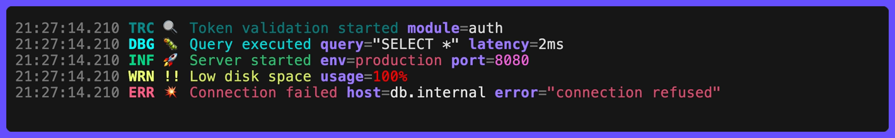

# Styles

Customise the visual appearance using [lipgloss](https://charm.land/lipgloss/v2) styles:



```go
clog.SetStyles(&style.Config{
  // Customise level colors
  Levels: style.LevelMap{
    clog.LevelError: new(
      lipgloss.NewStyle().Bold(true).Foreground(lipgloss.Color("9")), // bright red
    ),
  },
  // Customise field key appearance
  KeyDefault: new(
    lipgloss.NewStyle().Bold(true).Foreground(lipgloss.Color("12")), // bright blue
  ),
})
```

`SetStyles` merges non-zero fields into the existing configuration - only the fields you set are changed, all others keep their current values.

## Value Coloring

Values are styled with a three-tier priority system:

1. **Key styles** - style all values of a specific field key
1. **Value styles** - style values matching a typed key (bool `true` != string `"true"`)
1. **Type styles** - style values by their Go type

```go
clog.SetStyles(&style.Config{
  // 1. Key styles: all values of the "status" field are green
  Keys: style.Map{
    "status": new(lipgloss.NewStyle().Foreground(lipgloss.Color("2"))),
  },
  // 2. Value styles: typed key matches (bool `true` != string "true")
  Values: style.ValueMap{
    "PASS": new(lipgloss.NewStyle().Foreground(lipgloss.Color("2"))),
    "FAIL": new(lipgloss.NewStyle().Foreground(lipgloss.Color("1"))),
  },
  // 3. Type styles
  FieldString: new(lipgloss.NewStyle().Foreground(lipgloss.Color("15"))),
  FieldNumber: new(lipgloss.NewStyle().Foreground(lipgloss.Color("5"))),
  FieldError:  new(lipgloss.NewStyle().Foreground(lipgloss.Color("1"))),
})
```

## Styles Reference

| Field                    | Type                     | Alias           | Default                      |
| ------------------------ | ------------------------ | --------------- | ---------------------------- |
| `Backtick`               | `Style`                  |                 | terracotta                   |
| `BacktickMode`           | `style.BacktickMode`     |                 | `style.BacktickStrip`        |
| `DurationGradient`       | `[]style.ColorStop`      |                 | green → yellow → red         |
| `DurationGradientMode`   | `style.GradientMode`     |                 | `style.GradientFade`         |
| `DurationThresholds`     | `map[string][]Threshold` | `ThresholdMap`  | `{}`                         |
| `DurationUnits`          | `map[string]Style`       | `StyleMap`      | `{}`                         |
| `ElapsedGradient`        | `[]style.ColorStop`      |                 | green → yellow → red         |
| `ElapsedGradientMode`    | `style.GradientMode`     |                 | `style.GradientFade`         |
| `FieldDurationNumber`    | `Style`                  |                 | magenta                      |
| `FieldDurationUnit`      | `Style`                  |                 | magenta faint                |
| `FieldElapsedNumber`     | `Style`                  |                 | `nil` (→ `DurationNumber`)   |
| `FieldElapsedUnit`       | `Style`                  |                 | `nil` (→ `DurationUnit`)     |
| `FieldError`             | `Style`                  |                 | red                          |
| `FieldFractionSeparator` | `Style`                  |                 | `nil` (→ value color, faint) |
| `FieldNumber`            | `Style`                  |                 | magenta                      |
| `FieldPercent`           | `Style`                  |                 | `nil`                        |
| `FieldQuantityNumber`    | `Style`                  |                 | magenta                      |
| `FieldQuantityUnit`      | `Style`                  |                 | magenta faint                |
| `FieldQuote`             | `*QuoteStyle`            |                 | `nil` (→ value's style)      |
| `FieldString`            | `Style`                  |                 | white                        |
| `FieldTime`              | `Style`                  |                 | magenta                      |
| `KeyDefault`             | `Style`                  |                 | blue                         |
| `Keys`                   | `map[string]Style`       | `StyleMap`      | `{}`                         |
| `Levels`                 | `map[Level]Style`        | `LevelStyleMap` | per-level bold colors        |
| `Messages`               | `map[Level]Style`        | `LevelStyleMap` | `style.DefaultMessages()`    |
| `PercentGradient`        | `[]style.ColorStop`      |                 | red → yellow → green         |
| `QuantityThresholds`     | `map[string][]Threshold` | `ThresholdMap`  | `{}`                         |
| `QuantityUnits`          | `map[string]Style`       | `StyleMap`      | `{}`                         |
| `Separator`              | `Style`                  |                 | faint                        |
| `Symbols`                | `map[Level]Style`        | `LevelStyleMap` | `{}`                         |
| `Timestamp`              | `Style`                  |                 | faint                        |
| `Values`                 | `map[any]Style`          | `ValueStyleMap` | `style.DefaultValues()`      |

### Syntax Highlighting

Per-token styles for the [Printer](printer.md). Each has a `Default*()` constructor with Dracula-inspired colors. Set to `nil` to disable highlighting for that format.

| Field  | Type          | Default               |
| ------ | ------------- | --------------------- |
| `HCL`  | `*style.HCL`  | `style.DefaultHCL()`  |
| `JSON` | `*style.JSON` | `style.DefaultJSON()` |
| `TOML` | `*style.TOML` | `style.DefaultTOML()` |
| `YAML` | `*style.YAML` | `style.DefaultYAML()` |

See [Printer](printer.md) for per-format token style tables.

### Field Descriptions

| Field                    | Description                                                                                    |
| ------------------------ | ---------------------------------------------------------------------------------------------- |
| `Backtick`               | Style for text inside backtick pairs in messages and string field values, nil to disable       |
| `BacktickMode`           | Backtick delimiters: `BacktickStrip` drops them, `BacktickKeep` keeps them (width-stable)      |
| `DurationGradient`       | Gradient color stops for `Duration` fields; active when `FieldFormats.DurationGradientMax` > 0 |
| `DurationGradientMode`   | Gradient transition mode: `GradientFade` (smooth) or `GradientStep` (discrete)                 |
| `DurationThresholds`     | Duration unit -> magnitude-based style thresholds                                              |
| `DurationUnits`          | Duration unit string -> style override                                                         |
| `ElapsedGradient`        | Gradient color stops for `Elapsed` fields; active when `FieldFormats.ElapsedGradientMax` > 0   |
| `ElapsedGradientMode`    | Gradient transition mode: `GradientFade` (smooth) or `GradientStep` (discrete)                 |
| `FieldDurationNumber`    | Style for numeric segments of duration values (e.g. "1" in "1m30s"), nil to disable            |
| `FieldDurationUnit`      | Style for unit segments of duration values (e.g. "m" in "1m30s"), nil to disable               |
| `FieldElapsedNumber`     | Style for numeric segments of elapsed-time values; nil falls back to `FieldDurationNumber`     |
| `FieldElapsedUnit`       | Style for unit segments of elapsed-time values; nil falls back to `FieldDurationUnit`          |
| `FieldError`             | Style for error field values, nil to disable                                                   |
| `FieldFractionSeparator` | Style for the `/` in fraction values; nil keeps the value's color and adds the faint attribute |
| `FieldNumber`            | Style for int/float field values, nil to disable                                               |
| `FieldPercent`           | Base style for `Percent` fields (foreground overridden by gradient), nil to disable            |
| `FieldQuantityNumber`    | Style for numeric part of quantity values (e.g. "5" in "5km"), nil to disable                  |
| `FieldQuantityUnit`      | Style for unit part of quantity values (e.g. "km" in "5km"), nil to disable                    |
| `FieldQuote`             | Style for the quote delimiters around quoted values (set `Inherit` to keep the value's color)  |
| `FieldString`            | Style for string field values, nil to disable                                                  |
| `FieldTime`              | Style for `time.Time` field values, nil to disable                                             |
| `KeyDefault`             | Style for field key names without a per-key override, nil to disable                           |
| `Keys`                   | Field key name -> value style override                                                         |
| `Levels`                 | Per-level label style (e.g. "INF", "ERR"), nil to disable                                      |
| `Messages`               | Per-level message text style, nil to disable                                                   |
| `PercentGradient`        | Gradient color stops for `Percent` fields                                                      |
| `QuantityThresholds`     | Quantity unit -> magnitude-based style thresholds                                              |
| `QuantityUnits`          | Quantity unit string -> style override                                                         |
| `Separator`              | Style for the separator between key and value                                                  |
| `Symbols`                | Per-level symbol style                                                                         |
| `Timestamp`              | Style for the timestamp, nil to disable                                                        |
| `Values`                 | Typed value -> style (uses Go equality, so bool `true` != string `"true"`)                     |

## Configuration

Behavioural settings are configured via setter methods on `Logger` (or package-level convenience functions for the `Default` logger):

| Setter                 | Type            | Default    | Description                                                          |
| ---------------------- | --------------- | ---------- | -------------------------------------------------------------------- |
| `SetAnimationInterval` | `time.Duration` | `67ms`     | Minimum refresh interval for all animations (0 = use built-in rates) |
| `SetFieldSort`         | `Sort`          | `SortNone` | Sort order: `SortNone`, `SortAscending`, `SortDescending`            |
| `SetSeparatorText`     | `string`        | `"="`      | Key/value separator string                                           |

Field formatting behaviour (gradient maxima, format functions, percent precision, hyperlink formats, etc.) is configured per-logger via the `FieldFormats` struct - see [Field Formats](configuration.md#field-formats).

Each `Threshold` pairs a minimum value with style overrides:

```go
type ThresholdStyle struct {
  Number Style // Override for the number segment (nil = keep default).
  Unit   Style // Override for the unit segment (nil = keep default).
}

type Threshold struct {
  Value float64        // Minimum numeric value (inclusive) to trigger this style.
  Style ThresholdStyle // Style overrides for number and unit segments.
}
```

Thresholds are evaluated in descending order - the first match wins:

```go
styles.QuantityThresholds["ms"] = style.Thresholds{
  {Value: 5000, Style: style.ThresholdStyle{Number: redStyle, Unit: redStyle}},
  {Value: 1000, Style: style.ThresholdStyle{Number: yellowStyle, Unit: yellowStyle}},
}
```

Value styles only apply at `Info` level and above by default. Use `SetFieldStyleLevel` to change the threshold.

## Backtick Spans

Text inside a matched pair of backticks - in the message or in string field values - is rendered with the `Backtick` style. By default the delimiters are dropped (`style.BacktickStrip`), which shrinks the message by two visible columns per span. For pre-aligned content such as grid-padded table rows, use `style.BacktickKeep` to render the delimiters as part of the styled span, so the visible width is exactly what was written:

```go
clog.SetStyles(&style.Config{BacktickMode: style.BacktickKeep})
```

An unmatched backtick is content, not a delimiter, and is left untouched in both modes. A non-color writer always leaves backticks exactly as written.

## Per-Level Message Styles

Style the log message text differently for each level:

```go
clog.SetStyles(&style.Config{
  Messages: style.LevelMap{
    clog.LevelError: new(lipgloss.NewStyle().Foreground(lipgloss.Color("1"))),
    clog.LevelWarn:  new(lipgloss.NewStyle().Foreground(lipgloss.Color("3"))),
  },
})
```

Use `style.DefaultMessages()` to get the defaults (unstyled for all levels).

Use `style.DefaultValues()` to get the default value styles (`true`=green, `false`=red, `nil`=grey, `""`=grey).

Use `style.DefaultPercentGradient()` to get the default red → yellow → green gradient stops used for `Percent` fields.

## Percent Gradient Direction

By default the `Percent` gradient runs red (0%) → yellow (50%) → green (100%) - useful when a higher value is better (e.g. battery, health score). For metrics where a lower value is better (CPU usage, disk usage, error rate), reverse the gradient:

```go
// Logger-wide: all Percent fields
f := clog.DefaultFieldFormats()
f.PercentReverseGradient = true
clog.SetFieldFormats(f)

// Per-field: just this Percent field, regardless of the logger setting
clog.Info().
  Percent("cpu", 0.92, percent.WithReverseGradient()).
  Percent("battery", 0.85).
  Msg("System status")
// "cpu" renders red at 92%, "battery" renders green at 85%
```

`percent.WithReverseGradient()` is a `percent.Option` passed directly to `Event.Percent`. It **toggles** the logger's `PercentReverseGradient` setting for that field - so if the gradient is already reversed, `percent.WithReverseGradient()` flips it back to normal. This makes it easy to mix metrics with different semantics on the same log line regardless of the logger default.

## Duration Gradient

Color `Duration` fields on a gradient that transitions from green (fast) through yellow to red (slow). Set a max duration to enable the gradient - duration values are mapped onto 0→max, clamping at max:

```go
f := clog.DefaultFieldFormats()
f.DurationGradientMax = 20 * time.Second
clog.SetFieldFormats(f)
```

When active, the gradient overrides `FieldDurationNumber` / `FieldDurationUnit` and colors the entire formatted string. When the max is 0 (the default) or `DurationGradient` stops are nil, the existing number/unit split styling is used.

Use `style.DefaultElapsedGradient()` to get the default green → yellow → red gradient stops (shared with `Elapsed` by default).

The `DurationGradientMode` field controls transition style - see [Gradient Mode](#gradient-mode) below.

## Elapsed Gradient

Color elapsed-time fields on a gradient that transitions from green (fast) through yellow to red (slow). Set a max duration to enable the gradient - elapsed values are mapped onto 0→max, clamping at max:

```go
f := clog.DefaultFieldFormats()
f.ElapsedGradientMax = 30 * time.Second
clog.SetFieldFormats(f)
```

When active, the gradient overrides `FieldElapsedNumber` / `FieldElapsedUnit` and colors the entire formatted string. When the max is 0 (the default) or `ElapsedGradient` stops are nil, the existing number/unit split styling is used.

Use `style.DefaultElapsedGradient()` to get the default green → yellow → red gradient stops used for `Elapsed` fields (same stops as `DurationGradient` by default).

### Gradient Mode

Both `DurationGradientMode` and `ElapsedGradientMode` control how colors transition between stops:

| Mode                 | Description                                  |
| -------------------- | -------------------------------------------- |
| `style.GradientFade` | Smooth interpolation between stops (default) |
| `style.GradientStep` | Discrete color jumps at stop boundaries      |

**Fade** blends smoothly between adjacent color stops using perceptually uniform CIE-LCh interpolation. **Step** uses the color of the last stop whose position is ≤ the current value - no blending.

```go
clog.SetStyles(&style.Config{ElapsedGradientMode: style.GradientStep})
```

### Custom Stops

```go
clog.SetStyles(&style.Config{
  ElapsedGradient: []style.ColorStop{
    {Position: 0, Color: colorful.Color{R: 0, G: 1, B: 0}},   // green
    {Position: 1, Color: colorful.Color{R: 1, G: 0, B: 0}},   // red
  },
})
```

## Format Hooks

Override the default formatting for `Elapsed` and `Percent` fields via `FieldFormats`:

```go
f := clog.DefaultFieldFormats()

// Custom elapsed format: truncate to whole seconds
f.ElapsedFormat = func(d time.Duration) string {
  return d.Truncate(time.Second).String()
}

// Custom percent format: "75/100" instead of "75%"
f.PercentFormat = func(v float64) string {
  return fmt.Sprintf("%.0f/100", v)
}

clog.SetFieldFormats(f)
```

When set to `nil` (the default), the built-in formatters are used (`formatElapsed` with `ElapsedPrecision` for elapsed, `strconv.FormatFloat` with `PercentPrecision` + "%" for percent). Custom percent format functions receive the **display** percentage (0–100), not the raw stored value.

## Field Sort Order

Control the order fields appear in log output. By default fields preserve insertion order.

```go
// Sort fields alphabetically by key
clog.SetFieldSort(clog.SortAscending)

// Or reverse alphabetical
clog.SetFieldSort(clog.SortDescending)
```

| Constant         | Description                        |
| ---------------- | ---------------------------------- |
| `SortNone`       | Preserve insertion order (default) |
| `SortAscending`  | Sort fields by key A→Z             |
| `SortDescending` | Sort fields by key Z→A             |

```go
clog.Info().
  Str("zoo", "animals").
  Str("alpha", "first").
  Int("count", 42).
  Msg("Sorted")
// SortNone:       INF ℹ️ Sorted zoo=animals alpha=first count=42
// SortAscending:  INF ℹ️ Sorted alpha=first count=42 zoo=animals
// SortDescending: INF ℹ️ Sorted zoo=animals count=42 alpha=first
```
